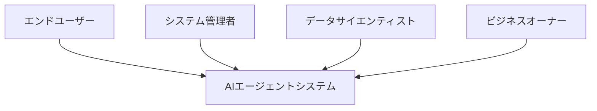
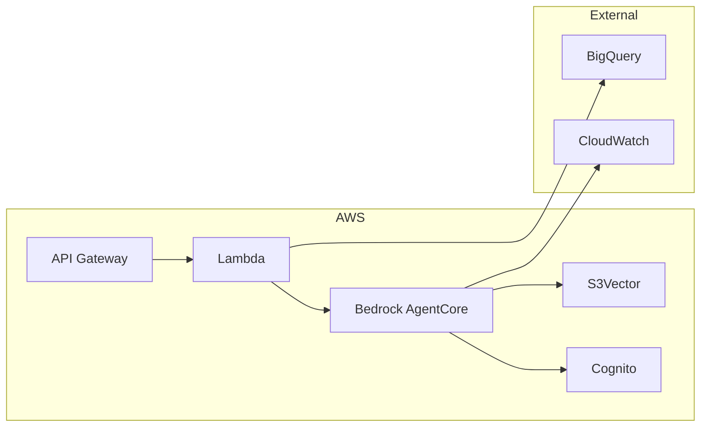

# ビジネスコンテキスト

## 1. ビジネス目標

### 1.1 主要ビジネスドメイン
AIエージェントによるRAG（Retrieval-Augmented Generation）システムの提供

### 1.2 ビジネス目標
| ID | 目標 | KPI |
|----|------|-----|
| BG-01 | コスト最適化 | 月額コスト50%削減 |
| BG-02 | パフォーマンス向上 | レスポンス時間3倍高速化 |
| BG-03 | 運用効率化 | 運用工数60%削減 |
| BG-04 | スケーラビリティ | オートスケーリング対応 |

### 1.3 ステークホルダー


| ステークホルダー | 関心事 | 期待値 |
|----------------|--------|--------|
| エンドユーザー | 高速レスポンス、正確な回答 | <1秒のレスポンス |
| システム管理者 | 運用負荷軽減 | セルフマネージド |
| データサイエンティスト | 柔軟なモデル選択 | マルチモデル対応 |
| ビジネスオーナー | ROI最大化 | 50%コスト削減 |

## 2. 外部システム

### 2.1 連携システム


### 2.2 システム境界
| システム | 責務 | インターフェース |
|---------|------|-----------------|
| API Gateway | リクエストルーティング | REST/WebSocket |
| Bedrock AgentCore | エージェント実行 | SDK |
| S3Vector | ベクトル検索 | AWS SDK |
| Cognito | 認証・認可 | OAuth2/OIDC |
| BigQuery | ログ分析 | REST API |

## 3. バリューチェーン

```
[データ取込] → [ベクトル化] → [インデックス] → [クエリ] → [回答生成] → [配信]
     ↓              ↓            ↓           ↓           ↓          ↓
  S3/API        Bedrock      S3Vector    AgentCore   Bedrock    Gateway
```

## 4. 制約事項

### 4.1 技術的制約
- AWS東京リージョン（ap-northeast-1）
- Python 3.11+
- Node.js 20+
- Next.js 15

### 4.2 ビジネス制約
- 月額予算: $XXX以内
- SLA: 99.9%稼働率
- レスポンス: P95 < 2秒

