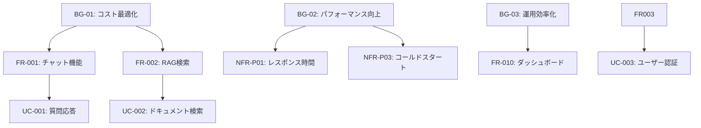

# 要件定義

## 1. 機能要件

### 1.1 コア機能

#### FR-001: チャット機能
| 項目 | 内容 |
|------|------|
| 説明 | ユーザーとAIエージェント間の対話機能 |
| 優先度 | Must |
| 受入条件 | ストリーミングレスポンス対応 |

#### FR-002: RAG検索機能
| 項目 | 内容 |
|------|------|
| 説明 | ナレッジベースからの関連情報検索 |
| 優先度 | Must |
| 受入条件 | S3Vectorによるベクトル検索 |

#### FR-003: マルチテナント対応
| 項目 | 内容 |
|------|------|
| 説明 | 組織・ユーザー単位でのデータ分離 |
| 優先度 | Must |
| 受入条件 | Cognito統合によるRBAC |

#### FR-004: 会話履歴管理
| 項目 | 内容 |
|------|------|
| 説明 | セッション単位の会話コンテキスト保持 |
| 優先度 | Must |
| 受入条件 | AgentCore Memoryによる管理 |

#### FR-005: ドキュメント管理
| 項目 | 内容 |
|------|------|
| 説明 | ナレッジベースへのドキュメント登録・更新 |
| 優先度 | Should |
| 受入条件 | S3アップロード + 自動ベクトル化 |

### 1.2 管理機能

#### FR-010: ダッシュボード
| 項目 | 内容 |
|------|------|
| 説明 | 利用状況・コスト・パフォーマンスの可視化 |
| 優先度 | Should |
| 受入条件 | BigQuery連携によるリアルタイム表示 |

#### FR-011: エージェント設定
| 項目 | 内容 |
|------|------|
| 説明 | プロンプト・モデル・パラメータの設定 |
| 優先度 | Should |
| 受入条件 | 管理UIからの動的変更 |

## 2. 非機能要件

### 2.1 パフォーマンス (NFR-P)

| ID | 要件 | 目標値 |
|----|------|--------|
| NFR-P01 | 平均レスポンス時間 | < 1秒 |
| NFR-P02 | P95レスポンス時間 | < 2秒 |
| NFR-P03 | コールドスタート | < 0.5秒 |
| NFR-P04 | 同時接続数 | 1000+ |

### 2.2 可用性 (NFR-A)

| ID | 要件 | 目標値 |
|----|------|--------|
| NFR-A01 | 稼働率 | 99.9% |
| NFR-A02 | MTTR | < 1時間 |
| NFR-A03 | RTO | < 4時間 |
| NFR-A04 | RPO | < 1時間 |

### 2.3 セキュリティ (NFR-S)

| ID | 要件 | 実装方法 |
|----|------|---------|
| NFR-S01 | 認証 | Cognito OAuth2/OIDC |
| NFR-S02 | 認可 | RBAC (Role-Based Access Control) |
| NFR-S03 | 通信暗号化 | TLS 1.3 |
| NFR-S04 | データ暗号化 | AES-256 at rest |

### 2.4 スケーラビリティ (NFR-SC)

| ID | 要件 | 実装方法 |
|----|------|---------|
| NFR-SC01 | 水平スケール | Lambda auto-scaling |
| NFR-SC02 | ストレージスケール | S3 unlimited |
| NFR-SC03 | ベクトルDBスケール | S3Vector auto-scale |

## 3. 要件トレーサビリティ

