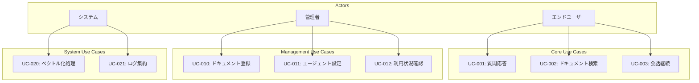
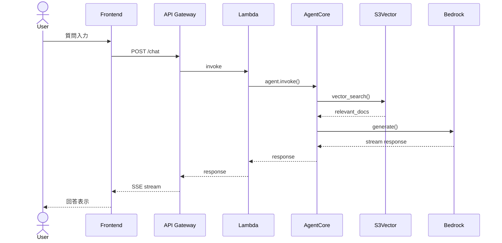

# ユースケース定義

## 1. ユースケース図

## 2. ユースケース詳細

### UC-001: 質問応答

| 項目 | 内容 |
|------|------|
| **アクター** | エンドユーザー |
| **事前条件** | ユーザー認証済み |
| **事後条件** | 回答が表示される |
| **トリガー** | ユーザーが質問を入力 |

#### 基本フロー
1. ユーザーがチャットUIで質問を入力
2. システムがS3Vectorで関連ドキュメントを検索
3. AgentCoreがコンテキストを組み立て
4. Bedrockモデルが回答を生成
5. ストリーミングで回答を表示
6. 会話履歴を保存

#### 代替フロー
- 3a. 関連ドキュメントが見つからない場合
  - 3a1. 一般知識で回答を試みる
  - 3a2. 「情報が見つかりません」と回答

#### 例外フロー
- E1. タイムアウト発生
  - E1.1. リトライを実行
  - E1.2. 3回失敗でエラー表示

#### シーケンス図

---

### UC-002: ドキュメント検索

| 項目 | 内容 |
|------|------|
| **アクター** | エンドユーザー |
| **事前条件** | ユーザー認証済み |
| **事後条件** | 検索結果が表示される |
| **トリガー** | ユーザーが検索クエリを入力 |

#### 基本フロー
1. ユーザーが検索クエリを入力
2. システムがクエリをベクトル化
3. S3Vectorで類似度検索を実行
4. 検索結果をランキング表示
5. ユーザーがドキュメントを選択

---

### UC-003: 会話継続

| 項目 | 内容 |
|------|------|
| **アクター** | エンドユーザー |
| **事前条件** | 既存の会話セッションが存在 |
| **事後条件** | コンテキストを維持した回答 |
| **トリガー** | フォローアップ質問 |

#### 基本フロー
1. ユーザーがフォローアップ質問を入力
2. AgentCore Memoryから会話履歴を取得
3. コンテキストを含めてプロンプト生成
4. 回答を生成・表示
5. 会話履歴を更新

---

### UC-010: ドキュメント登録

| 項目 | 内容 |
|------|------|
| **アクター** | 管理者 |
| **事前条件** | 管理者権限を保持 |
| **事後条件** | ドキュメントがベクトル化されインデックスに追加 |
| **トリガー** | ドキュメントアップロード |

#### 基本フロー
1. 管理者がドキュメントをアップロード
2. S3にファイルを保存
3. EventBridgeがベクトル化処理をトリガー
4. チャンク分割・埋め込み生成
5. S3Vectorにインデックス追加
6. 完了通知

---

### UC-011: エージェント設定

| 項目 | 内容 |
|------|------|
| **アクター** | 管理者 |
| **事前条件** | 管理者権限を保持 |
| **事後条件** | エージェント設定が更新される |
| **トリガー** | 設定変更リクエスト |

#### 設定可能項目
- システムプロンプト
- モデル選択（Claude, Titan等）
- Temperature
- Max Tokens
- RAG設定（Top-K, 類似度閾値）

---

### UC-012: 利用状況確認

| 項目 | 内容 |
|------|------|
| **アクター** | 管理者 |
| **事前条件** | 管理者権限を保持 |
| **事後条件** | ダッシュボードが表示される |
| **トリガー** | ダッシュボードアクセス |

#### 表示メトリクス
- リクエスト数（時間別/日別）
- トークン使用量
- レスポンス時間統計
- エラー率
- コスト推計

## 3. ユースケース-機能要件マッピング

| ユースケース | 関連機能要件 |
|-------------|-------------|
| UC-001 | FR-001, FR-002, FR-004 |
| UC-002 | FR-002 |
| UC-003 | FR-001, FR-004 |
| UC-010 | FR-005 |
| UC-011 | FR-011 |
| UC-012 | FR-010 |

