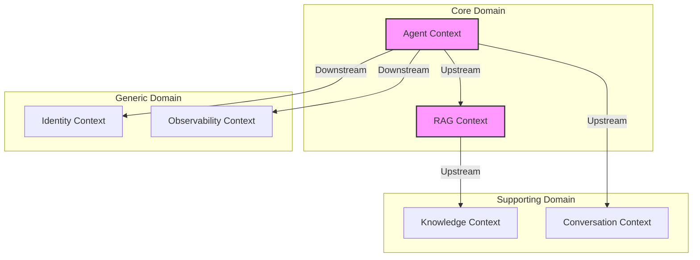

# 境界づけられたコンテキスト（Bounded Contexts）

## 1. コンテキストマップ



## 2. コンテキスト詳細

### 2.1 Agent Context（コアドメイン）

**責務**: AIエージェントの実行管理

```
┌─────────────────────────────────────────────┐
│ Agent Context                               │
├─────────────────────────────────────────────┤
│ Entities:                                   │
│   - Agent                                   │
│   - AgentSession                            │
│   - AgentConfig                             │
│                                             │
│ Value Objects:                              │
│   - Prompt                                  │
│   - Response                                │
│   - ModelParameters                         │
│                                             │
│ Domain Services:                            │
│   - AgentInvocationService                  │
│   - ResponseStreamingService                │
│                                             │
│ Domain Events:                              │
│   - AgentInvoked                            │
│   - ResponseGenerated                       │
│   - SessionStarted                          │
│   - SessionEnded                            │
└─────────────────────────────────────────────┘
```

**ユビキタス言語**:
| 用語 | 定義 |
|------|------|
| Agent | LLMを使用して質問に回答するAIエンティティ |
| Session | ユーザーとエージェント間の一連の会話 |
| Invoke | エージェントにリクエストを送信すること |
| Prompt | エージェントへの入力テキスト |
| Response | エージェントからの出力テキスト |

---

### 2.2 RAG Context（コアドメイン）

**責務**: 検索拡張生成の実行

```
┌─────────────────────────────────────────────┐
│ RAG Context                                 │
├─────────────────────────────────────────────┤
│ Entities:                                   │
│   - Query                                   │
│   - SearchResult                            │
│   - RetrievalContext                        │
│                                             │
│ Value Objects:                              │
│   - Embedding                               │
│   - SimilarityScore                         │
│   - RetrievalConfig                         │
│                                             │
│ Domain Services:                            │
│   - VectorSearchService                     │
│   - ContextAssemblyService                  │
│   - RerankingService                        │
│                                             │
│ Domain Events:                              │
│   - SearchExecuted                          │
│   - ContextAssembled                        │
│   - NoResultsFound                          │
└─────────────────────────────────────────────┘
```

**ユビキタス言語**:
| 用語 | 定義 |
|------|------|
| Query | ベクトル検索のための入力クエリ |
| Embedding | テキストの数値ベクトル表現 |
| Retrieval | 関連ドキュメントの検索取得 |
| Context | LLMに渡す検索結果のコンテキスト |
| Reranking | 検索結果の関連度による再順位付け |

---

### 2.3 Knowledge Context（サポートドメイン）

**責務**: ナレッジベースの管理

```
┌─────────────────────────────────────────────┐
│ Knowledge Context                           │
├─────────────────────────────────────────────┤
│ Entities:                                   │
│   - Document                                │
│   - Chunk                                   │
│   - KnowledgeBase                           │
│                                             │
│ Value Objects:                              │
│   - DocumentMetadata                        │
│   - ChunkContent                            │
│   - ChunkingStrategy                        │
│                                             │
│ Domain Services:                            │
│   - DocumentIngestionService                │
│   - ChunkingService                         │
│   - EmbeddingService                        │
│                                             │
│ Domain Events:                              │
│   - DocumentUploaded                        │
│   - DocumentChunked                         │
│   - EmbeddingGenerated                      │
│   - IndexUpdated                            │
└─────────────────────────────────────────────┘
```

---

### 2.4 Conversation Context（サポートドメイン）

**責務**: 会話履歴の管理

```
┌─────────────────────────────────────────────┐
│ Conversation Context                        │
├─────────────────────────────────────────────┤
│ Entities:                                   │
│   - Conversation                            │
│   - Message                                 │
│   - Turn                                    │
│                                             │
│ Value Objects:                              │
│   - MessageContent                          │
│   - Timestamp                               │
│   - MessageRole                             │
│                                             │
│ Domain Services:                            │
│   - ConversationManagementService           │
│   - MessagePersistenceService               │
│                                             │
│ Domain Events:                              │
│   - ConversationCreated                     │
│   - MessageAdded                            │
│   - ConversationArchived                    │
└─────────────────────────────────────────────┘
```

---

### 2.5 Identity Context（汎用ドメイン）

**責務**: 認証・認可管理

```
┌─────────────────────────────────────────────┐
│ Identity Context                            │
├─────────────────────────────────────────────┤
│ Entities:                                   │
│   - User                                    │
│   - Tenant                                  │
│   - Role                                    │
│                                             │
│ Value Objects:                              │
│   - UserId                                  │
│   - TenantId                                │
│   - Permission                              │
│                                             │
│ Domain Services:                            │
│   - AuthenticationService                   │
│   - AuthorizationService                    │
│                                             │
│ Domain Events:                              │
│   - UserAuthenticated                       │
│   - AccessGranted                           │
│   - AccessDenied                            │
└─────────────────────────────────────────────┘
```

---

### 2.6 Observability Context（汎用ドメイン）

**責務**: 監視・ログ・分析

```
┌─────────────────────────────────────────────┐
│ Observability Context                       │
├─────────────────────────────────────────────┤
│ Entities:                                   │
│   - Trace                                   │
│   - Metric                                  │
│   - LogEntry                                │
│                                             │
│ Value Objects:                              │
│   - TraceId                                 │
│   - MetricValue                             │
│   - LogLevel                                │
│                                             │
│ Domain Services:                            │
│   - TracingService                          │
│   - MetricsCollectionService                │
│   - LogAggregationService                   │
│                                             │
│ Domain Events:                              │
│   - TraceRecorded                           │
│   - MetricEmitted                           │
│   - AlertTriggered                          │
└─────────────────────────────────────────────┘
```

## 3. コンテキスト間関係

| Upstream | Downstream | 関係タイプ | 説明 |
|----------|------------|-----------|------|
| Agent | RAG | Partnership | 密接な協調 |
| Agent | Conversation | Customer-Supplier | 会話履歴の提供 |
| RAG | Knowledge | Conformist | ナレッジ構造に従う |
| Identity | Agent | Anti-Corruption Layer | 認証情報の変換 |
| Observability | Agent | Published Language | 標準ログ形式 |

## 4. 共有カーネル

```
┌─────────────────────────────────────────────┐
│ Shared Kernel                               │
├─────────────────────────────────────────────┤
│ - UserId                                    │
│ - TenantId                                  │
│ - SessionId                                 │
│ - Timestamp                                 │
│ - TraceId                                   │
│ - ErrorCodes                                │
└─────────────────────────────────────────────┘
```

