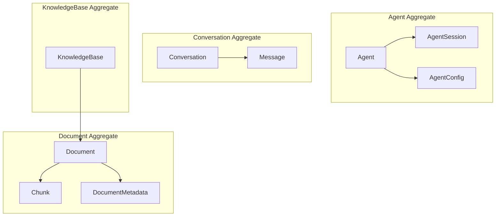

# ドメインモデル

## 1. Agent Context ドメインモデル

### 1.1 エンティティ

```python
# Agent Entity (Aggregate Root)
class Agent:
    """AIエージェントを表すエンティティ"""
    id: AgentId                     # 識別子
    name: str                       # エージェント名
    config: AgentConfig             # 設定
    status: AgentStatus             # 状態
    created_at: datetime            # 作成日時
    updated_at: datetime            # 更新日時
    
    def invoke(self, prompt: Prompt, session: Session) -> Response:
        """エージェントを呼び出す"""
        pass
    
    def update_config(self, config: AgentConfig) -> None:
        """設定を更新する"""
        pass

# AgentSession Entity
class AgentSession:
    """エージェントとのセッションを表すエンティティ"""
    id: SessionId                   # 識別子
    agent_id: AgentId               # エージェントID
    user_id: UserId                 # ユーザーID
    tenant_id: TenantId             # テナントID
    status: SessionStatus           # 状態
    started_at: datetime            # 開始日時
    ended_at: Optional[datetime]    # 終了日時
```

### 1.2 値オブジェクト

```python
# Value Objects
@dataclass(frozen=True)
class AgentId:
    value: str

@dataclass(frozen=True)
class Prompt:
    content: str
    role: MessageRole = MessageRole.USER
    
    def __post_init__(self):
        if not self.content.strip():
            raise ValueError("Prompt content cannot be empty")

@dataclass(frozen=True)
class Response:
    content: str
    tokens_used: int
    model: str
    latency_ms: int
    sources: List[Source]

@dataclass(frozen=True)
class ModelParameters:
    model_id: str
    temperature: float = 0.7
    max_tokens: int = 4096
    top_p: float = 0.9
    
    def __post_init__(self):
        if not 0 <= self.temperature <= 1:
            raise ValueError("Temperature must be between 0 and 1")

@dataclass(frozen=True)
class AgentConfig:
    system_prompt: str
    model_params: ModelParameters
    rag_config: RagConfig
    guardrails: List[Guardrail]
```

### 1.3 ドメインイベント

```python
@dataclass(frozen=True)
class AgentInvoked(DomainEvent):
    agent_id: AgentId
    session_id: SessionId
    prompt: Prompt
    timestamp: datetime

@dataclass(frozen=True)
class ResponseGenerated(DomainEvent):
    agent_id: AgentId
    session_id: SessionId
    response: Response
    timestamp: datetime

@dataclass(frozen=True)
class SessionStarted(DomainEvent):
    session_id: SessionId
    agent_id: AgentId
    user_id: UserId
    timestamp: datetime

@dataclass(frozen=True)
class SessionEnded(DomainEvent):
    session_id: SessionId
    reason: SessionEndReason
    timestamp: datetime
```

---

## 2. RAG Context ドメインモデル

### 2.1 エンティティ

```python
# Query Entity
class Query:
    """検索クエリを表すエンティティ"""
    id: QueryId
    text: str
    embedding: Embedding
    config: RetrievalConfig
    created_at: datetime

# SearchResult Entity
class SearchResult:
    """検索結果を表すエンティティ"""
    id: SearchResultId
    query_id: QueryId
    chunks: List[RetrievedChunk]
    total_count: int
    search_time_ms: int

# RetrievalContext Entity
class RetrievalContext:
    """検索コンテキストを表すエンティティ"""
    id: ContextId
    search_result: SearchResult
    formatted_context: str
    token_count: int
```

### 2.2 値オブジェクト

```python
@dataclass(frozen=True)
class Embedding:
    vector: List[float]
    model: str
    dimensions: int
    
    def similarity(self, other: 'Embedding') -> float:
        """コサイン類似度を計算"""
        pass

@dataclass(frozen=True)
class SimilarityScore:
    value: float
    
    def __post_init__(self):
        if not 0 <= self.value <= 1:
            raise ValueError("Score must be between 0 and 1")

@dataclass(frozen=True)
class RetrievalConfig:
    top_k: int = 5
    similarity_threshold: float = 0.7
    rerank_enabled: bool = True
    max_context_tokens: int = 4000

@dataclass(frozen=True)
class RetrievedChunk:
    chunk_id: ChunkId
    content: str
    score: SimilarityScore
    metadata: ChunkMetadata
```

### 2.3 ドメインイベント

```python
@dataclass(frozen=True)
class SearchExecuted(DomainEvent):
    query_id: QueryId
    results_count: int
    search_time_ms: int
    timestamp: datetime

@dataclass(frozen=True)
class ContextAssembled(DomainEvent):
    context_id: ContextId
    query_id: QueryId
    token_count: int
    timestamp: datetime

@dataclass(frozen=True)
class NoResultsFound(DomainEvent):
    query_id: QueryId
    query_text: str
    timestamp: datetime
```

---

## 3. Knowledge Context ドメインモデル

### 3.1 エンティティ

```python
# Document Entity (Aggregate Root)
class Document:
    """ドキュメントを表すエンティティ"""
    id: DocumentId
    title: str
    content: str
    metadata: DocumentMetadata
    chunks: List[Chunk]
    status: DocumentStatus
    created_at: datetime
    updated_at: datetime
    
    def chunk(self, strategy: ChunkingStrategy) -> List[Chunk]:
        """ドキュメントをチャンク分割"""
        pass

# Chunk Entity
class Chunk:
    """チャンクを表すエンティティ"""
    id: ChunkId
    document_id: DocumentId
    content: str
    embedding: Optional[Embedding]
    position: int
    metadata: ChunkMetadata

# KnowledgeBase Entity
class KnowledgeBase:
    """ナレッジベースを表すエンティティ"""
    id: KnowledgeBaseId
    name: str
    tenant_id: TenantId
    documents: List[Document]
    config: KnowledgeBaseConfig
```

### 3.2 値オブジェクト

```python
@dataclass(frozen=True)
class DocumentMetadata:
    source: str
    file_type: str
    author: Optional[str]
    created_date: Optional[datetime]
    tags: List[str]
    custom_fields: Dict[str, Any]

@dataclass(frozen=True)
class ChunkMetadata:
    start_position: int
    end_position: int
    page_number: Optional[int]
    section: Optional[str]

@dataclass(frozen=True)
class ChunkingStrategy:
    method: ChunkingMethod  # FIXED_SIZE, SEMANTIC, SENTENCE
    chunk_size: int = 512
    overlap: int = 50
```

### 3.3 ドメインイベント

```python
@dataclass(frozen=True)
class DocumentUploaded(DomainEvent):
    document_id: DocumentId
    knowledge_base_id: KnowledgeBaseId
    file_name: str
    timestamp: datetime

@dataclass(frozen=True)
class DocumentChunked(DomainEvent):
    document_id: DocumentId
    chunk_count: int
    strategy: ChunkingStrategy
    timestamp: datetime

@dataclass(frozen=True)
class EmbeddingGenerated(DomainEvent):
    chunk_id: ChunkId
    embedding_model: str
    dimensions: int
    timestamp: datetime

@dataclass(frozen=True)
class IndexUpdated(DomainEvent):
    knowledge_base_id: KnowledgeBaseId
    document_id: DocumentId
    chunks_indexed: int
    timestamp: datetime
```

---

## 4. Conversation Context ドメインモデル

### 4.1 エンティティ

```python
# Conversation Entity (Aggregate Root)
class Conversation:
    """会話を表すエンティティ"""
    id: ConversationId
    session_id: SessionId
    user_id: UserId
    messages: List[Message]
    created_at: datetime
    updated_at: datetime
    
    def add_message(self, message: Message) -> None:
        """メッセージを追加"""
        pass
    
    def get_context(self, max_turns: int = 10) -> List[Message]:
        """会話コンテキストを取得"""
        pass

# Message Entity
class Message:
    """メッセージを表すエンティティ"""
    id: MessageId
    conversation_id: ConversationId
    role: MessageRole
    content: MessageContent
    timestamp: datetime
```

### 4.2 値オブジェクト

```python
class MessageRole(Enum):
    USER = "user"
    ASSISTANT = "assistant"
    SYSTEM = "system"

@dataclass(frozen=True)
class MessageContent:
    text: str
    attachments: List[Attachment] = field(default_factory=list)
    
    @property
    def token_count(self) -> int:
        """トークン数を推定"""
        pass
```

---

## 5. 集約とライフサイクル



## 6. ドメインサービス

```python
class AgentInvocationService:
    """エージェント呼び出しを調整するドメインサービス"""
    
    def invoke(
        self,
        agent: Agent,
        session: AgentSession,
        prompt: Prompt,
        rag_service: VectorSearchService
    ) -> Response:
        # 1. RAG検索
        context = rag_service.search(prompt.content)
        
        # 2. コンテキスト組み立て
        augmented_prompt = self._augment_prompt(prompt, context)
        
        # 3. エージェント呼び出し
        response = agent.invoke(augmented_prompt, session)
        
        # 4. イベント発行
        self._publish_event(AgentInvoked(...))
        
        return response

class VectorSearchService:
    """ベクトル検索を実行するドメインサービス"""
    
    def search(self, query_text: str, config: RetrievalConfig) -> RetrievalContext:
        # 1. クエリをベクトル化
        embedding = self._embed(query_text)
        
        # 2. 類似度検索
        results = self._search_similar(embedding, config.top_k)
        
        # 3. リランキング（オプション）
        if config.rerank_enabled:
            results = self._rerank(query_text, results)
        
        # 4. コンテキスト組み立て
        return self._assemble_context(results, config.max_context_tokens)
```

