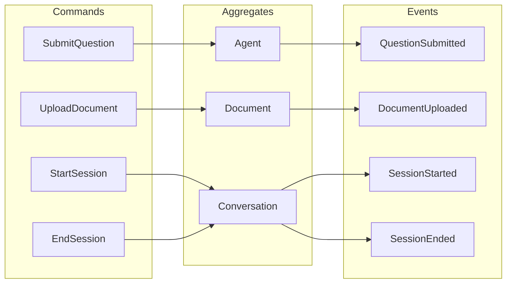

# イベントストーミング

## 1. Big Picture イベントストーミング

```
Timeline →
─────────────────────────────────────────────────────────────────────────────────>

┌─────────────┐   ┌─────────────┐   ┌─────────────┐   ┌─────────────┐
│   🟧        │   │   🟧        │   │   🟧        │   │   🟧        │
│ User        │   │ Question    │   │ Search      │   │ Response    │
│ Logged In   │──>│ Submitted   │──>│ Executed    │──>│ Generated   │
│             │   │             │   │             │   │             │
└─────────────┘   └─────────────┘   └─────────────┘   └─────────────┘
                        │                 │                 │
                        ▼                 ▼                 ▼
                  ┌─────────────┐   ┌─────────────┐   ┌─────────────┐
                  │   🟦        │   │   🟦        │   │   🟦        │
                  │ Agent       │   │ S3Vector    │   │ Bedrock     │
                  │ Core        │   │             │   │             │
                  └─────────────┘   └─────────────┘   └─────────────┘
```

## 2. プロセスレベル イベントストーミング

### 2.1 質問応答フロー

```
┌──────────────────────────────────────────────────────────────────────────────┐
│                          質問応答フロー                                        │
├──────────────────────────────────────────────────────────────────────────────┤
│                                                                              │
│  🟨 Command         🟧 Event           🟪 Policy          🟦 Actor/System   │
│                                                                              │
│  ┌─────────────┐   ┌─────────────┐                      ┌─────────────┐    │
│  │ 🟨          │   │ 🟧          │                      │ 🟦          │    │
│  │ Submit      │──>│ Question    │                      │ User        │    │
│  │ Question    │   │ Submitted   │                      │             │    │
│  └─────────────┘   └─────────────┘                      └─────────────┘    │
│                          │                                                   │
│                          ▼                                                   │
│                    ┌─────────────┐                                          │
│                    │ 🟪          │                                          │
│                    │ When Question                                          │
│                    │ Submitted,  │                                          │
│                    │ Search KB   │                                          │
│                    └─────────────┘                                          │
│                          │                                                   │
│                          ▼                                                   │
│  ┌─────────────┐   ┌─────────────┐                      ┌─────────────┐    │
│  │ 🟨          │   │ 🟧          │                      │ 🟦          │    │
│  │ Search      │──>│ Search      │                      │ S3Vector    │    │
│  │ Knowledge   │   │ Executed    │                      │             │    │
│  └─────────────┘   └─────────────┘                      └─────────────┘    │
│                          │                                                   │
│                          ├──────────────────────┐                           │
│                          ▼                      ▼                           │
│                    ┌─────────────┐        ┌─────────────┐                   │
│                    │ 🟧          │        │ 🟧          │                   │
│                    │ Results     │        │ No Results  │                   │
│                    │ Found       │        │ Found       │                   │
│                    └─────────────┘        └─────────────┘                   │
│                          │                      │                           │
│                          ▼                      ▼                           │
│                    ┌─────────────┐        ┌─────────────┐                   │
│                    │ 🟪          │        │ 🟪          │                   │
│                    │ Assemble    │        │ Use General │                   │
│                    │ Context     │        │ Knowledge   │                   │
│                    └─────────────┘        └─────────────┘                   │
│                          │                      │                           │
│                          └──────────┬───────────┘                           │
│                                     ▼                                       │
│  ┌─────────────┐   ┌─────────────┐                      ┌─────────────┐    │
│  │ 🟨          │   │ 🟧          │                      │ 🟦          │    │
│  │ Generate    │──>│ Response    │                      │ Bedrock     │    │
│  │ Response    │   │ Generated   │                      │             │    │
│  └─────────────┘   └─────────────┘                      └─────────────┘    │
│                          │                                                   │
│                          ▼                                                   │
│                    ┌─────────────┐                                          │
│                    │ 🟪          │                                          │
│                    │ Store in    │                                          │
│                    │ Conversation│                                          │
│                    └─────────────┘                                          │
│                          │                                                   │
│                          ▼                                                   │
│  ┌─────────────┐   ┌─────────────┐                      ┌─────────────┐    │
│  │ 🟨          │   │ 🟧          │                      │ 🟦          │    │
│  │ Save        │──>│ Message     │                      │ Memory      │    │
│  │ Message     │   │ Saved       │                      │             │    │
│  └─────────────┘   └─────────────┘                      └─────────────┘    │
│                                                                              │
└──────────────────────────────────────────────────────────────────────────────┘
```

### 2.2 ドキュメント登録フロー

```
┌──────────────────────────────────────────────────────────────────────────────┐
│                       ドキュメント登録フロー                                    │
├──────────────────────────────────────────────────────────────────────────────┤
│                                                                              │
│  ┌─────────────┐   ┌─────────────┐                      ┌─────────────┐    │
│  │ 🟨          │   │ 🟧          │                      │ 🟦          │    │
│  │ Upload      │──>│ Document    │                      │ Admin       │    │
│  │ Document    │   │ Uploaded    │                      │             │    │
│  └─────────────┘   └─────────────┘                      └─────────────┘    │
│                          │                                                   │
│                          ▼                                                   │
│                    ┌─────────────┐                                          │
│                    │ 🟪          │                                          │
│                    │ When Upload,│                                          │
│                    │ Start       │                                          │
│                    │ Processing  │                                          │
│                    └─────────────┘                                          │
│                          │                                                   │
│                          ▼                                                   │
│  ┌─────────────┐   ┌─────────────┐                      ┌─────────────┐    │
│  │ 🟨          │   │ 🟧          │                      │ 🟦          │    │
│  │ Chunk       │──>│ Document    │                      │ Chunking    │    │
│  │ Document    │   │ Chunked     │                      │ Service     │    │
│  └─────────────┘   └─────────────┘                      └─────────────┘    │
│                          │                                                   │
│                          ▼                                                   │
│                    ┌─────────────┐                                          │
│                    │ 🟪          │                                          │
│                    │ For Each    │                                          │
│                    │ Chunk,      │                                          │
│                    │ Generate    │                                          │
│                    │ Embedding   │                                          │
│                    └─────────────┘                                          │
│                          │                                                   │
│                          ▼                                                   │
│  ┌─────────────┐   ┌─────────────┐                      ┌─────────────┐    │
│  │ 🟨          │   │ 🟧          │                      │ 🟦          │    │
│  │ Generate    │──>│ Embedding   │                      │ Bedrock     │    │
│  │ Embedding   │   │ Generated   │                      │ Embedding   │    │
│  └─────────────┘   └─────────────┘                      └─────────────┘    │
│                          │                                                   │
│                          ▼                                                   │
│  ┌─────────────┐   ┌─────────────┐                      ┌─────────────┐    │
│  │ 🟨          │   │ 🟧          │                      │ 🟦          │    │
│  │ Index       │──>│ Index       │                      │ S3Vector    │    │
│  │ Chunk       │   │ Updated     │                      │             │    │
│  └─────────────┘   └─────────────┘                      └─────────────┘    │
│                          │                                                   │
│                          ▼                                                   │
│                    ┌─────────────┐                                          │
│                    │ 🟧          │                                          │
│                    │ Document    │                                          │
│                    │ Ready       │                                          │
│                    └─────────────┘                                          │
│                                                                              │
└──────────────────────────────────────────────────────────────────────────────┘
```

## 3. ドメインイベント一覧

### 3.1 Agent Context イベント

| イベント | トリガー | 結果 |
|---------|---------|------|
| `SessionStarted` | ユーザーが会話を開始 | セッション作成 |
| `QuestionSubmitted` | ユーザーが質問を送信 | 処理開始 |
| `AgentInvoked` | 質問が処理される | LLM呼び出し |
| `ResponseGenerated` | LLMが回答を生成 | 回答配信 |
| `ResponseStreamed` | ストリーミング送信 | UI更新 |
| `SessionEnded` | ユーザーが会話を終了 | セッション終了 |

### 3.2 RAG Context イベント

| イベント | トリガー | 結果 |
|---------|---------|------|
| `SearchExecuted` | 質問がベクトル化される | 検索実行 |
| `ResultsFound` | 類似ドキュメント発見 | コンテキスト構築 |
| `NoResultsFound` | 類似ドキュメントなし | フォールバック |
| `ContextAssembled` | 検索結果整形 | プロンプト拡張 |
| `RerankingCompleted` | 再ランキング完了 | 最終結果 |

### 3.3 Knowledge Context イベント

| イベント | トリガー | 結果 |
|---------|---------|------|
| `DocumentUploaded` | 管理者がアップロード | 処理開始 |
| `DocumentValidated` | ファイル検証完了 | チャンク開始 |
| `DocumentChunked` | チャンク分割完了 | 埋め込み開始 |
| `EmbeddingGenerated` | 埋め込み生成完了 | インデックス開始 |
| `IndexUpdated` | インデックス更新完了 | 検索可能 |
| `DocumentDeleted` | 管理者が削除 | インデックス削除 |

### 3.4 Conversation Context イベント

| イベント | トリガー | 結果 |
|---------|---------|------|
| `ConversationCreated` | 新規会話開始 | 会話作成 |
| `MessageAdded` | メッセージ送受信 | 履歴更新 |
| `ConversationArchived` | 一定期間経過 | アーカイブ |

## 4. 集約とコマンド



## 5. リードモデル

| リードモデル | 用途 | 更新トリガー |
|-------------|------|-------------|
| `ChatView` | チャットUI表示 | `MessageAdded` |
| `SearchResultView` | 検索結果表示 | `SearchExecuted` |
| `DocumentListView` | ドキュメント一覧 | `IndexUpdated` |
| `AnalyticsDashboard` | 分析ダッシュボード | 全イベント |
| `UsageMetrics` | 使用量メトリクス | `ResponseGenerated` |

## 6. ポリシー（自動処理）

```python
# When DocumentUploaded -> Start Processing
@policy("document_processing")
async def on_document_uploaded(event: DocumentUploaded):
    await chunk_document(event.document_id)
    await generate_embeddings(event.document_id)
    await update_index(event.document_id)

# When QuestionSubmitted -> Execute RAG
@policy("rag_execution")
async def on_question_submitted(event: QuestionSubmitted):
    results = await search_knowledge_base(event.question)
    context = await assemble_context(results)
    response = await generate_response(event.question, context)
    await stream_response(event.session_id, response)

# When ResponseGenerated -> Log to BigQuery
@policy("analytics_logging")
async def on_response_generated(event: ResponseGenerated):
    await log_to_bigquery({
        "timestamp": event.timestamp,
        "tokens": event.response.tokens_used,
        "latency": event.response.latency_ms,
        "model": event.response.model
    })
```

