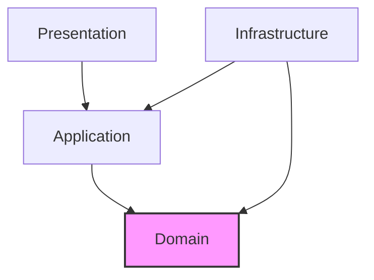

# クリーンアーキテクチャ設計

## 1. レイヤー構成

```
┌─────────────────────────────────────────────────────────────────────────────┐
│                              Presentation Layer                              │
│  ┌─────────────────────────────────────────────────────────────────────────┐│
│  │  AgentCore Entrypoint | Lambda Tool Handlers | Streaming Handlers       ││
│  └─────────────────────────────────────────────────────────────────────────┘│
├─────────────────────────────────────────────────────────────────────────────┤
│                              Application Layer                               │
│  ┌─────────────────────────────────────────────────────────────────────────┐│
│  │  Use Cases | Commands | Queries | DTOs | Event Handlers                 ││
│  └─────────────────────────────────────────────────────────────────────────┘│
├─────────────────────────────────────────────────────────────────────────────┤
│                                Domain Layer                                  │
│  ┌─────────────────────────────────────────────────────────────────────────┐│
│  │  Entities | Value Objects | Domain Services | Domain Events             ││
│  │  Aggregates | Repository Interfaces | Specifications                    ││
│  └─────────────────────────────────────────────────────────────────────────┘│
├─────────────────────────────────────────────────────────────────────────────┤
│                            Infrastructure Layer                              │
│  ┌─────────────────────────────────────────────────────────────────────────┐│
│  │  Repository Impl | External Services | Message Bus | Event Store        ││
│  │  AgentCore Memory Client | S3Vector Client | BigQuery Client            ││
│  └─────────────────────────────────────────────────────────────────────────┘│
└─────────────────────────────────────────────────────────────────────────────┘
```

## 2. 依存性の方向



**依存性ルール**:
- 外側のレイヤーは内側のレイヤーに依存できる
- 内側のレイヤーは外側のレイヤーを知らない
- ドメイン層は最も内側で、他のレイヤーに依存しない

## 3. AgentCore Runtime での実装

### 3.1 プロジェクト構成

```
backend/
├── src/
│   ├── domain/                    # ドメイン層
│   │   ├── agent/
│   │   ├── rag/
│   │   ├── knowledge/
│   │   └── shared/
│   ├── application/               # アプリケーション層
│   │   ├── commands/
│   │   ├── queries/
│   │   ├── event_handlers/
│   │   ├── dto/
│   │   └── interfaces/
│   ├── infrastructure/            # インフラストラクチャ層
│   │   ├── persistence/
│   │   ├── agentcore/             # AgentCore統合
│   │   ├── external_services/
│   │   └── config/
│   └── presentation/              # プレゼンテーション層
│       ├── entrypoint/            # AgentCore Entrypoint
│       ├── tools/                 # Lambda Tool Handlers
│       └── streaming/             # Streaming Response
├── agent.py                       # AgentCore エントリーポイント
├── pyproject.toml
├── requirements.txt
└── Dockerfile
```

### 3.2 AgentCore Entrypoint

```python
# agent.py - AgentCore Runtime エントリーポイント
from bedrock_agentcore.runtime import BedrockAgentCoreApp
from strands import Agent, tool

from src.presentation.entrypoint.agent_entrypoint import create_agent
from src.infrastructure.config.di_container import DIContainer
from src.infrastructure.config.settings import Settings

# AgentCore App初期化
app = BedrockAgentCoreApp()

# DI Container初期化
settings = Settings()
container = DIContainer(settings)

# Agent作成
agent = create_agent(container)

@app.entrypoint
async def invoke(payload: dict):
    """AgentCore Runtime エントリーポイント"""
    prompt = payload.get("prompt", "")
    session_id = payload.get("session_id", "")
    user_id = payload.get("user_id", "")
    tenant_id = payload.get("tenant_id", "")
    
    # Use Case実行
    handler = container.submit_question_handler
    response = await handler.handle(
        SubmitQuestionCommand(
            session_id=session_id,
            user_id=user_id,
            question=prompt,
            tenant_id=tenant_id
        )
    )
    
    return response

@app.entrypoint
async def stream(payload: dict):
    """ストリーミングレスポンス用エントリーポイント"""
    prompt = payload.get("prompt", "")
    session_id = payload.get("session_id", "")
    
    async for chunk in agent.stream(prompt, session_id=session_id):
        yield chunk

if __name__ == "__main__":
    app.run()
```

## 4. 各レイヤーの責務

### 4.1 Domain Layer（ドメイン層）

```python
# backend/src/domain/
├── agent/
│   ├── entities/
│   │   ├── agent.py              # Agent エンティティ
│   │   └── agent_session.py      # AgentSession エンティティ
│   ├── value_objects/
│   │   ├── agent_id.py           # AgentId 値オブジェクト
│   │   ├── prompt.py             # Prompt 値オブジェクト
│   │   └── response.py           # Response 値オブジェクト
│   ├── events/
│   │   ├── agent_invoked.py      # AgentInvoked イベント
│   │   └── response_generated.py # ResponseGenerated イベント
│   ├── services/
│   │   └── agent_invocation_service.py
│   └── repositories/
│       └── agent_repository.py   # インターフェース
├── rag/
│   ├── entities/
│   │   └── chunk.py              # Chunk エンティティ
│   ├── value_objects/
│   │   ├── embedding.py          # Embedding 値オブジェクト
│   │   └── relevance_score.py    # RelevanceScore 値オブジェクト
│   ├── events/
│   │   └── chunks_retrieved.py   # ChunksRetrieved イベント
│   └── services/
│       └── rag_service.py        # RAG検索サービス（インターフェース）
├── knowledge/
│   ├── entities/
│   │   └── document.py           # Document エンティティ
│   ├── value_objects/
│   │   └── document_status.py    # DocumentStatus 値オブジェクト
│   ├── events/
│   │   ├── document_uploaded.py  # DocumentUploaded イベント
│   │   └── document_indexed.py   # DocumentIndexed イベント
│   └── services/
│       └── document_service.py   # ドキュメント管理サービス
└── shared/
    ├── entity.py                 # 基底エンティティ
    ├── value_object.py           # 基底値オブジェクト
    ├── domain_event.py           # 基底ドメインイベント
    └── aggregate_root.py         # 集約ルート
```

### 4.2 Application Layer（アプリケーション層）

```python
# backend/src/application/
├── commands/
│   ├── submit_question/
│   │   ├── command.py            # SubmitQuestionCommand
│   │   └── handler.py            # SubmitQuestionHandler
│   ├── upload_document/
│   │   ├── command.py
│   │   └── handler.py
│   └── start_session/
│       ├── command.py
│       └── handler.py
├── queries/
│   ├── get_conversation/
│   │   ├── query.py              # GetConversationQuery
│   │   └── handler.py            # GetConversationHandler
│   ├── search_documents/
│   │   ├── query.py
│   │   └── handler.py
│   └── get_analytics/
│       ├── query.py
│       └── handler.py
├── event_handlers/
│   ├── on_question_submitted.py
│   ├── on_response_generated.py
│   └── on_document_uploaded.py
├── dto/
│   ├── chat_response.py
│   ├── document_dto.py
│   └── session_dto.py
└── interfaces/
    ├── command_bus.py
    ├── query_bus.py
    ├── event_bus.py
    ├── memory_service.py         # AgentCore Memory抽象化
    └── rag_service.py            # S3Vector RAG抽象化
```

### 4.3 Infrastructure Layer（インフラストラクチャ層）

```python
# backend/src/infrastructure/
├── persistence/
│   ├── repositories/
│   │   ├── agent_repository_impl.py
│   │   ├── conversation_repository_impl.py
│   │   └── document_repository_impl.py
│   ├── event_store/
│   │   ├── dynamodb_event_store.py
│   │   └── event_store.py
│   └── read_models/
│       ├── chat_view_repository.py
│       └── analytics_repository.py
├── agentcore/                     # AgentCore統合
│   ├── memory_client.py          # AgentCore Memory実装
│   ├── identity_client.py        # AgentCore Identity実装
│   └── gateway_client.py         # AgentCore Gateway実装
├── external_services/
│   ├── bedrock/
│   │   ├── llm_client.py         # Bedrock LLM
│   │   └── embedding_client.py   # Bedrock Embedding
│   ├── s3vector/
│   │   └── s3vector_client.py    # S3Vector検索
│   └── bigquery/
│       └── bigquery_client.py    # Analytics
├── messaging/
│   ├── event_bus_impl.py
│   ├── command_bus_impl.py
│   └── query_bus_impl.py
└── config/
    ├── settings.py
    └── di_container.py
```

### 4.4 Presentation Layer（プレゼンテーション層）

```python
# backend/src/presentation/
├── entrypoint/
│   ├── agent_entrypoint.py       # AgentCore Runtime メイン
│   └── agent_factory.py          # Strands Agent作成
├── tools/                         # Lambda Tool Handlers
│   ├── customer_tool.py          # 顧客情報取得Tool
│   ├── order_tool.py             # 注文情報取得Tool
│   ├── knowledge_tool.py         # Knowledge Base検索Tool
│   └── analytics_tool.py         # 分析データ取得Tool
├── streaming/
│   └── stream_handler.py         # SSE Streaming Handler
└── schemas/
    ├── chat_schema.py            # リクエスト/レスポンススキーマ
    └── tool_schema.py            # Tool I/Oスキーマ
```

## 5. AgentCore 統合パターン

### 5.1 AgentCore Memory 統合

```python
# infrastructure/agentcore/memory_client.py
from bedrock_agentcore.memory import MemoryClient
from src.application.interfaces.memory_service import MemoryService

class AgentCoreMemoryService(MemoryService):
    """AgentCore Memoryの実装"""
    
    def __init__(self, region: str, memory_id: str):
        self._client = MemoryClient(region_name=region)
        self._memory_id = memory_id
    
    async def save_conversation(
        self,
        session_id: str,
        user_id: str,
        messages: List[Message]
    ) -> None:
        """会話を短期メモリに保存"""
        await self._client.create_event(
            memory_id=self._memory_id,
            actor_id=user_id,
            session_id=session_id,
            messages=[
                (msg.content, msg.role.upper())
                for msg in messages
            ]
        )
    
    async def load_conversation(
        self,
        session_id: str,
        user_id: str,
        max_turns: int = 10
    ) -> List[Message]:
        """短期メモリから会話履歴を取得"""
        events = await self._client.list_events(
            memory_id=self._memory_id,
            actor_id=user_id,
            session_id=session_id,
            max_results=max_turns
        )
        return self._convert_to_messages(events)
    
    async def retrieve_semantic_memory(
        self,
        user_id: str,
        query: str
    ) -> List[MemoryFact]:
        """セマンティックメモリから関連事実を検索"""
        memories = await self._client.retrieve_memories(
            memory_id=self._memory_id,
            namespace=f"/facts/{user_id}",
            query=query
        )
        return [MemoryFact.from_dict(m) for m in memories]
```

### 5.2 Lambda Tool 実装

```python
# presentation/tools/customer_tool.py
from strands import tool
from src.infrastructure.config.di_container import container

@tool
def get_customer_info(email: str) -> str:
    """顧客情報をメールアドレスから取得する
    
    Args:
        email: 顧客のメールアドレス
    
    Returns:
        顧客情報のJSON文字列
    """
    # Use Caseを呼び出し
    handler = container.get_customer_handler
    result = handler.handle(GetCustomerQuery(email=email))
    return result.to_json()

@tool
def search_orders(customer_id: str) -> str:
    """顧客の注文履歴を検索する
    
    Args:
        customer_id: 顧客ID
    
    Returns:
        注文情報のJSON文字列
    """
    handler = container.search_orders_handler
    result = handler.handle(SearchOrdersQuery(customer_id=customer_id))
    return result.to_json()

@tool
def search_knowledge_base(query: str, tenant_id: str) -> str:
    """ナレッジベースを検索する
    
    Args:
        query: 検索クエリ
        tenant_id: テナントID（フィルタリング用）
    
    Returns:
        関連するドキュメントチャンクのJSON文字列
    """
    handler = container.search_knowledge_handler
    result = handler.handle(
        SearchKnowledgeQuery(query=query, tenant_id=tenant_id)
    )
    return result.to_json()
```

### 5.3 Agent Factory

```python
# presentation/entrypoint/agent_factory.py
from strands import Agent
from strands_tools import calculator, current_time

from src.presentation.tools.customer_tool import get_customer_info, search_orders
from src.presentation.tools.knowledge_tool import search_knowledge_base
from src.infrastructure.agentcore.memory_client import AgentCoreMemoryService

SYSTEM_PROMPT = """
あなたは優秀なカスタマーサポートアシスタントです。

以下のツールを使用して、顧客の質問に回答してください：
- get_customer_info: 顧客情報の取得
- search_orders: 注文履歴の検索
- search_knowledge_base: ナレッジベースの検索

回答は丁寧で分かりやすい日本語で行ってください。
"""

def create_agent(container) -> Agent:
    """Strands Agentを作成"""
    
    memory_service = container.memory_service
    
    agent = Agent(
        model="us.amazon.nova-pro-v1:0",
        system_prompt=SYSTEM_PROMPT,
        tools=[
            calculator,
            current_time,
            get_customer_info,
            search_orders,
            search_knowledge_base,
        ],
        # AgentCore Memory統合
        memory=memory_service,
    )
    
    return agent
```

## 6. CQRS パターン

```
┌─────────────────────────────────────────────────────────────────────────────┐
│                               CQRS Architecture                              │
├─────────────────────────────────────────────────────────────────────────────┤
│                                                                             │
│   ┌───────────────┐                           ┌───────────────┐            │
│   │   Command     │                           │    Query      │            │
│   │   (Write)     │                           │    (Read)     │            │
│   └───────┬───────┘                           └───────┬───────┘            │
│           │                                           │                     │
│           ▼                                           ▼                     │
│   ┌───────────────┐                           ┌───────────────┐            │
│   │ Command       │                           │ Query         │            │
│   │ Handler       │                           │ Handler       │            │
│   └───────┬───────┘                           └───────┬───────┘            │
│           │                                           │                     │
│           ▼                                           ▼                     │
│   ┌───────────────┐                           ┌───────────────┐            │
│   │ Domain        │                           │ Read Model    │            │
│   │ Model         │                           │ Repository    │            │
│   └───────┬───────┘                           └───────┬───────┘            │
│           │                                           │                     │
│           ▼                                           ▼                     │
│   ┌───────────────┐      Events       ┌───────────────┐                    │
│   │ Event Store   │─────────────────>│ Read Model    │                    │
│   │ (DynamoDB)    │    Projection    │ (DynamoDB)    │                    │
│   └───────────────┘                   └───────────────┘                    │
│                                                                             │
│   AgentCore Memory: 会話履歴は AgentCore Memory で管理                      │
│   Event Store: ドメインイベントは DynamoDB で永続化                          │
│                                                                             │
└─────────────────────────────────────────────────────────────────────────────┘
```

### 6.1 Command フロー（Streaming対応）

```python
# application/commands/submit_question/handler.py
from dataclasses import dataclass
from typing import AsyncIterator

@dataclass
class SubmitQuestionCommand:
    session_id: str
    user_id: str
    question: str
    tenant_id: str

class SubmitQuestionHandler:
    def __init__(
        self,
        agent: Agent,
        memory_service: MemoryService,
        rag_service: RagService,
        event_store: EventStore
    ):
        self._agent = agent
        self._memory_service = memory_service
        self._rag_service = rag_service
        self._event_store = event_store
    
    async def handle(self, command: SubmitQuestionCommand) -> str:
        """非ストリーミングレスポンス"""
        # 1. 会話履歴をロード
        history = await self._memory_service.load_conversation(
            session_id=command.session_id,
            user_id=command.user_id
        )
        
        # 2. RAG検索（テナント分離）
        context = await self._rag_service.search(
            query=command.question,
            tenant_id=command.tenant_id
        )
        
        # 3. エージェント実行
        response = self._agent(
            command.question,
            history=history,
            context=context
        )
        
        # 4. 会話をメモリに保存
        await self._memory_service.save_conversation(
            session_id=command.session_id,
            user_id=command.user_id,
            messages=[
                Message(role="user", content=command.question),
                Message(role="assistant", content=response.content)
            ]
        )
        
        # 5. イベント保存
        await self._event_store.append(
            ResponseGenerated(
                session_id=command.session_id,
                user_id=command.user_id,
                question=command.question,
                response=response.content
            )
        )
        
        return response.content
    
    async def handle_stream(
        self,
        command: SubmitQuestionCommand
    ) -> AsyncIterator[str]:
        """ストリーミングレスポンス"""
        # 1. 会話履歴をロード
        history = await self._memory_service.load_conversation(
            session_id=command.session_id,
            user_id=command.user_id
        )
        
        # 2. RAG検索
        context = await self._rag_service.search(
            query=command.question,
            tenant_id=command.tenant_id
        )
        
        # 3. ストリーミング実行
        full_response = ""
        async for chunk in self._agent.stream(
            command.question,
            history=history,
            context=context
        ):
            full_response += chunk
            yield chunk
        
        # 4. 完了後にメモリ保存
        await self._memory_service.save_conversation(
            session_id=command.session_id,
            user_id=command.user_id,
            messages=[
                Message(role="user", content=command.question),
                Message(role="assistant", content=full_response)
            ]
        )
        
        # 5. イベント保存
        await self._event_store.append(
            ResponseGenerated(
                session_id=command.session_id,
                user_id=command.user_id,
                question=command.question,
                response=full_response
            )
        )
```

### 6.2 Query フロー

```python
# application/queries/get_conversation/handler.py
@dataclass
class GetConversationQuery:
    session_id: str
    user_id: str

class GetConversationHandler:
    def __init__(
        self,
        memory_service: MemoryService,
        read_model: ConversationReadModel
    ):
        self._memory_service = memory_service
        self._read_model = read_model
    
    async def handle(self, query: GetConversationQuery) -> ConversationDTO:
        # AgentCore Memoryから会話履歴を取得
        messages = await self._memory_service.load_conversation(
            session_id=query.session_id,
            user_id=query.user_id
        )
        
        # Read Modelからメタデータを取得
        metadata = await self._read_model.get_metadata(
            session_id=query.session_id
        )
        
        return ConversationDTO(
            session_id=query.session_id,
            messages=messages,
            metadata=metadata
        )
```

## 7. Event Sourcing

```
┌─────────────────────────────────────────────────────────────────────────────┐
│                           Event Sourcing Flow                                │
├─────────────────────────────────────────────────────────────────────────────┤
│                                                                             │
│   Command ─┬─> Aggregate ─┬─> Events ─┬─> Event Store (DynamoDB)           │
│            │              │           │                                     │
│            │              │           └─> Projections ─> Read Models       │
│            │              │                                                 │
│            │              └─> AgentCore Memory (会話履歴)                   │
│            │                                                                │
│            └─> Validation                                                   │
│                                                                             │
└─────────────────────────────────────────────────────────────────────────────┘
```

### 7.1 Event Store 実装

```python
# infrastructure/persistence/event_store/dynamodb_event_store.py
class DynamoDBEventStore(EventStore):
    def __init__(self, table_name: str):
        self._table = boto3.resource('dynamodb').Table(table_name)
    
    async def append(self, event: DomainEvent) -> None:
        item = {
            "pk": f"{event.aggregate_type}#{event.aggregate_id}",
            "sk": f"v{event.version:010d}",
            "event_type": event.__class__.__name__,
            "data": event.to_dict(),
            "timestamp": event.timestamp.isoformat(),
            "tenant_id": event.tenant_id,
            "metadata": event.metadata
        }
        await asyncio.to_thread(self._table.put_item, Item=item)
    
    async def get_events(
        self,
        aggregate_id: str,
        aggregate_type: str,
        from_version: int = 0
    ) -> List[DomainEvent]:
        response = await asyncio.to_thread(
            self._table.query,
            KeyConditionExpression=Key('pk').eq(f"{aggregate_type}#{aggregate_id}")
                & Key('sk').gte(f"v{from_version:010d}")
        )
        return [self._deserialize(item) for item in response['Items']]
```

### 7.2 Projection（リードモデル更新）

```python
# infrastructure/persistence/read_models/conversation_projection.py
class ConversationProjection:
    """会話イベントからリードモデルを構築
    
    DynamoDB Streams → Lambda → Projection
    """
    
    def __init__(self, read_model_table: str):
        self._table = boto3.resource('dynamodb').Table(read_model_table)
    
    async def project(self, event: DomainEvent) -> None:
        match event:
            case SessionStarted():
                await self._create_session(event)
            case ResponseGenerated():
                await self._update_metrics(event)
            case SessionEnded():
                await self._close_session(event)
    
    async def _update_metrics(self, event: ResponseGenerated) -> None:
        await asyncio.to_thread(
            self._table.update_item,
            Key={
                'pk': f"USER#{event.user_id}",
                'sk': f"SESSION#{event.session_id}"
            },
            UpdateExpression="SET message_count = message_count + :inc, updated_at = :ts",
            ExpressionAttributeValues={
                ':inc': 1,
                ':ts': event.timestamp.isoformat()
            }
        )
```

## 8. 依存性注入

```python
# infrastructure/config/di_container.py
class DIContainer:
    def __init__(self, settings: Settings):
        self._settings = settings
        self._instances = {}
    
    @property
    def memory_service(self) -> MemoryService:
        if "memory_service" not in self._instances:
            self._instances["memory_service"] = AgentCoreMemoryService(
                region=self._settings.aws_region,
                memory_id=self._settings.agentcore_memory_id
            )
        return self._instances["memory_service"]
    
    @property
    def rag_service(self) -> RagService:
        if "rag_service" not in self._instances:
            self._instances["rag_service"] = S3VectorRagService(
                knowledge_base_id=self._settings.knowledge_base_id
            )
        return self._instances["rag_service"]
    
    @property
    def event_store(self) -> EventStore:
        if "event_store" not in self._instances:
            self._instances["event_store"] = DynamoDBEventStore(
                table_name=self._settings.event_store_table
            )
        return self._instances["event_store"]
    
    @property
    def submit_question_handler(self) -> SubmitQuestionHandler:
        return SubmitQuestionHandler(
            agent=self.agent,
            memory_service=self.memory_service,
            rag_service=self.rag_service,
            event_store=self.event_store
        )
    
    @property
    def agent(self) -> Agent:
        if "agent" not in self._instances:
            from src.presentation.entrypoint.agent_factory import create_agent
            self._instances["agent"] = create_agent(self)
        return self._instances["agent"]
```

## 9. Dockerfile

```dockerfile
# backend/Dockerfile
FROM python:3.11-slim

WORKDIR /app

# 依存関係インストール
COPY requirements.txt .
RUN pip install --no-cache-dir -r requirements.txt

# アプリケーションコピー
COPY src/ ./src/
COPY agent.py .

# AgentCore Runtime用エントリーポイント
CMD ["python", "agent.py"]
```
