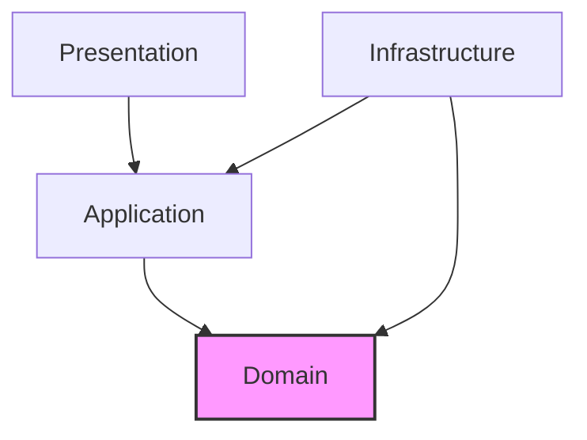

# クリーンアーキテクチャ設計

## 1. レイヤー構成

```
┌─────────────────────────────────────────────────────────────────────────────┐
│                              Presentation Layer                              │
│  ┌─────────────────────────────────────────────────────────────────────────┐│
│  │  Lambda Handlers | API Controllers | WebSocket Handlers                 ││
│  └─────────────────────────────────────────────────────────────────────────┘│
├─────────────────────────────────────────────────────────────────────────────┤
│                              Application Layer                               │
│  ┌─────────────────────────────────────────────────────────────────────────┐│
│  │  Use Cases | Commands | Queries | DTOs | Event Handlers                 ││
│  └─────────────────────────────────────────────────────────────────────────┘│
├─────────────────────────────────────────────────────────────────────────────┤
│                                Domain Layer                                  │
│  ┌─────────────────────────────────────────────────────────────────────────┐│
│  │  Entities | Value Objects | Domain Services | Domain Events             ││
│  │  Aggregates | Repository Interfaces | Specifications                    ││
│  └─────────────────────────────────────────────────────────────────────────┘│
├─────────────────────────────────────────────────────────────────────────────┤
│                            Infrastructure Layer                              │
│  ┌─────────────────────────────────────────────────────────────────────────┐│
│  │  Repository Impl | External Services | Message Bus | Event Store        ││
│  │  S3Vector Client | AgentCore Client | BigQuery Client                   ││
│  └─────────────────────────────────────────────────────────────────────────┘│
└─────────────────────────────────────────────────────────────────────────────┘
```

## 2. 依存性の方向



**依存性ルール**:
- 外側のレイヤーは内側のレイヤーに依存できる
- 内側のレイヤーは外側のレイヤーを知らない
- ドメイン層は最も内側で、他のレイヤーに依存しない

## 3. 各レイヤーの責務

### 3.1 Domain Layer（ドメイン層）

```python
# backend/src/domain/
├── agent/
│   ├── entities/
│   │   ├── agent.py              # Agent エンティティ
│   │   └── agent_session.py      # AgentSession エンティティ
│   ├── value_objects/
│   │   ├── agent_id.py           # AgentId 値オブジェクト
│   │   ├── prompt.py             # Prompt 値オブジェクト
│   │   └── response.py           # Response 値オブジェクト
│   ├── events/
│   │   ├── agent_invoked.py      # AgentInvoked イベント
│   │   └── response_generated.py # ResponseGenerated イベント
│   ├── services/
│   │   └── agent_invocation_service.py
│   └── repositories/
│       └── agent_repository.py   # インターフェース
├── rag/
│   ├── entities/
│   ├── value_objects/
│   ├── events/
│   └── services/
├── knowledge/
│   ├── entities/
│   ├── value_objects/
│   ├── events/
│   └── services/
└── shared/
    ├── entity.py                 # 基底エンティティ
    ├── value_object.py           # 基底値オブジェクト
    ├── domain_event.py           # 基底ドメインイベント
    └── aggregate_root.py         # 集約ルート
```

### 3.2 Application Layer（アプリケーション層）

```python
# backend/src/application/
├── commands/
│   ├── submit_question/
│   │   ├── command.py            # SubmitQuestionCommand
│   │   └── handler.py            # SubmitQuestionHandler
│   ├── upload_document/
│   │   ├── command.py
│   │   └── handler.py
│   └── start_session/
│       ├── command.py
│       └── handler.py
├── queries/
│   ├── get_conversation/
│   │   ├── query.py              # GetConversationQuery
│   │   └── handler.py            # GetConversationHandler
│   ├── search_documents/
│   │   ├── query.py
│   │   └── handler.py
│   └── get_analytics/
│       ├── query.py
│       └── handler.py
├── event_handlers/
│   ├── on_question_submitted.py
│   ├── on_response_generated.py
│   └── on_document_uploaded.py
├── dto/
│   ├── chat_response.py
│   ├── document_dto.py
│   └── session_dto.py
└── interfaces/
    ├── command_bus.py
    ├── query_bus.py
    └── event_bus.py
```

### 3.3 Infrastructure Layer（インフラストラクチャ層）

```python
# backend/src/infrastructure/
├── persistence/
│   ├── repositories/
│   │   ├── agent_repository_impl.py
│   │   ├── conversation_repository_impl.py
│   │   └── document_repository_impl.py
│   ├── event_store/
│   │   ├── dynamodb_event_store.py
│   │   └── event_store.py
│   └── read_models/
│       ├── chat_view_repository.py
│       └── analytics_repository.py
├── external_services/
│   ├── bedrock/
│   │   ├── agent_core_client.py
│   │   └── embedding_client.py
│   ├── s3vector/
│   │   └── s3vector_client.py
│   ├── cognito/
│   │   └── cognito_client.py
│   └── bigquery/
│       └── bigquery_client.py
├── messaging/
│   ├── event_bus_impl.py
│   ├── command_bus_impl.py
│   └── query_bus_impl.py
└── config/
    ├── settings.py
    └── di_container.py
```

### 3.4 Presentation Layer（プレゼンテーション層）

```python
# backend/src/presentation/
├── lambda_handlers/
│   ├── chat_handler.py
│   ├── document_handler.py
│   ├── session_handler.py
│   └── analytics_handler.py
├── api/
│   ├── routes/
│   │   ├── chat_routes.py
│   │   ├── document_routes.py
│   │   └── admin_routes.py
│   ├── middleware/
│   │   ├── auth_middleware.py
│   │   ├── error_handler.py
│   │   └── logging_middleware.py
│   └── schemas/
│       ├── chat_schema.py
│       └── document_schema.py
└── websocket/
    └── stream_handler.py
```

## 4. CQRS パターン

```
┌─────────────────────────────────────────────────────────────────────────────┐
│                               CQRS Architecture                              │
├─────────────────────────────────────────────────────────────────────────────┤
│                                                                             │
│   ┌───────────────┐                           ┌───────────────┐            │
│   │   Command     │                           │    Query      │            │
│   │   (Write)     │                           │    (Read)     │            │
│   └───────┬───────┘                           └───────┬───────┘            │
│           │                                           │                     │
│           ▼                                           ▼                     │
│   ┌───────────────┐                           ┌───────────────┐            │
│   │ Command       │                           │ Query         │            │
│   │ Handler       │                           │ Handler       │            │
│   └───────┬───────┘                           └───────┬───────┘            │
│           │                                           │                     │
│           ▼                                           ▼                     │
│   ┌───────────────┐                           ┌───────────────┐            │
│   │ Domain        │                           │ Read Model    │            │
│   │ Model         │                           │ Repository    │            │
│   └───────┬───────┘                           └───────┬───────┘            │
│           │                                           │                     │
│           ▼                                           ▼                     │
│   ┌───────────────┐      Events       ┌───────────────┐                    │
│   │ Event Store   │─────────────────>│ Read Model    │                    │
│   │ (Write DB)    │    Projection    │ (Read DB)     │                    │
│   └───────────────┘                   └───────────────┘                    │
│                                                                             │
└─────────────────────────────────────────────────────────────────────────────┘
```

### 4.1 Command フロー

```python
# Command定義
@dataclass
class SubmitQuestionCommand:
    session_id: str
    user_id: str
    question: str
    tenant_id: str

# Command Handler
class SubmitQuestionHandler:
    def __init__(
        self,
        agent_repository: AgentRepository,
        rag_service: RagService,
        event_store: EventStore
    ):
        self._agent_repository = agent_repository
        self._rag_service = rag_service
        self._event_store = event_store
    
    async def handle(self, command: SubmitQuestionCommand) -> str:
        # 1. 集約をロード
        agent = await self._agent_repository.get_by_session(command.session_id)
        
        # 2. RAG検索
        context = await self._rag_service.search(command.question)
        
        # 3. ドメインロジック実行
        response = agent.invoke(
            prompt=Prompt(command.question),
            context=context
        )
        
        # 4. イベント保存
        await self._event_store.append(
            ResponseGenerated(
                agent_id=agent.id,
                session_id=command.session_id,
                response=response
            )
        )
        
        return response.content
```

### 4.2 Query フロー

```python
# Query定義
@dataclass
class GetConversationQuery:
    session_id: str
    user_id: str

# Query Handler
class GetConversationHandler:
    def __init__(self, read_model: ConversationReadModel):
        self._read_model = read_model
    
    async def handle(self, query: GetConversationQuery) -> ConversationDTO:
        return await self._read_model.get_conversation(
            session_id=query.session_id
        )
```

## 5. Event Sourcing

```
┌─────────────────────────────────────────────────────────────────────────────┐
│                           Event Sourcing Flow                                │
├─────────────────────────────────────────────────────────────────────────────┤
│                                                                             │
│   Command ─┬─> Aggregate ─┬─> Events ─┬─> Event Store                      │
│            │              │           │                                     │
│            │              │           └─> Projections ─> Read Models       │
│            │              │                                                 │
│            │              └─> Snapshot (optional)                          │
│            │                                                                │
│            └─> Validation                                                   │
│                                                                             │
└─────────────────────────────────────────────────────────────────────────────┘
```

### 5.1 Event Store 実装

```python
class EventStore(ABC):
    @abstractmethod
    async def append(self, event: DomainEvent) -> None:
        """イベントを追加"""
        pass
    
    @abstractmethod
    async def get_events(
        self,
        aggregate_id: str,
        aggregate_type: str,
        from_version: int = 0
    ) -> List[DomainEvent]:
        """イベントを取得"""
        pass

class DynamoDBEventStore(EventStore):
    async def append(self, event: DomainEvent) -> None:
        item = {
            "pk": f"{event.aggregate_type}#{event.aggregate_id}",
            "sk": f"v{event.version:010d}",
            "event_type": event.__class__.__name__,
            "data": event.to_dict(),
            "timestamp": event.timestamp.isoformat(),
            "metadata": event.metadata
        }
        await self._table.put_item(Item=item)
```

### 5.2 Projection（リードモデル更新）

```python
class ConversationProjection:
    """会話イベントからリードモデルを構築"""
    
    async def project(self, event: DomainEvent) -> None:
        match event:
            case SessionStarted():
                await self._create_conversation(event)
            case MessageAdded():
                await self._add_message(event)
            case ResponseGenerated():
                await self._add_response(event)
            case SessionEnded():
                await self._close_conversation(event)
```

## 6. 依存性注入

```python
# DI Container
class DIContainer:
    def __init__(self, settings: Settings):
        self._settings = settings
        self._instances = {}
    
    @property
    def agent_repository(self) -> AgentRepository:
        if "agent_repository" not in self._instances:
            self._instances["agent_repository"] = AgentRepositoryImpl(
                event_store=self.event_store
            )
        return self._instances["agent_repository"]
    
    @property
    def event_store(self) -> EventStore:
        if "event_store" not in self._instances:
            self._instances["event_store"] = DynamoDBEventStore(
                table_name=self._settings.event_store_table
            )
        return self._instances["event_store"]
    
    @property
    def submit_question_handler(self) -> SubmitQuestionHandler:
        return SubmitQuestionHandler(
            agent_repository=self.agent_repository,
            rag_service=self.rag_service,
            event_store=self.event_store
        )
```

