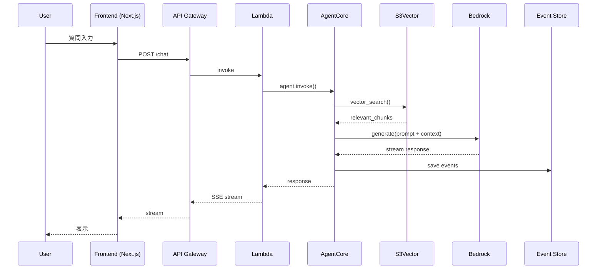
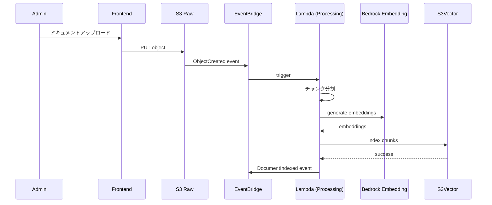

# システムアーキテクチャ

## 1. 全体構成図

```
┌──────────────────────────────────────────────────────────────────────────────────────┐
│                                    AWS Cloud                                          │
├──────────────────────────────────────────────────────────────────────────────────────┤
│                                                                                      │
│  ┌─────────────┐    ┌─────────────┐    ┌─────────────────────────────────────────┐  │
│  │   Route53   │───>│ CloudFront  │───>│           S3 (Frontend)                 │  │
│  │             │    │             │    │         Next.js Static Export           │  │
│  └─────────────┘    └─────────────┘    └─────────────────────────────────────────┘  │
│                                                                                      │
│  ┌─────────────────────────────────────────────────────────────────────────────────┐│
│  │                              API Layer                                          ││
│  │  ┌─────────────────────────────────────────────────────────────────────────┐   ││
│  │  │                         API Gateway                                      │   ││
│  │  │   REST API (HTTP)           WebSocket API (Streaming)                   │   ││
│  │  └─────────────────────────────────────────────────────────────────────────┘   ││
│  │                           │                        │                            ││
│  │                           ▼                        ▼                            ││
│  │  ┌─────────────────────────────────────────────────────────────────────────┐   ││
│  │  │                         Lambda Functions                                 │   ││
│  │  │   ┌───────────┐  ┌───────────┐  ┌───────────┐  ┌───────────┐           │   ││
│  │  │   │   Chat    │  │ Document  │  │  Session  │  │ Analytics │           │   ││
│  │  │   │  Handler  │  │  Handler  │  │  Handler  │  │  Handler  │           │   ││
│  │  │   └───────────┘  └───────────┘  └───────────┘  └───────────┘           │   ││
│  │  └─────────────────────────────────────────────────────────────────────────┘   ││
│  └─────────────────────────────────────────────────────────────────────────────────┘│
│                                                                                      │
│  ┌─────────────────────────────────────────────────────────────────────────────────┐│
│  │                            Core Services                                        ││
│  │                                                                                 ││
│  │  ┌───────────────────────────────┐   ┌───────────────────────────────────────┐ ││
│  │  │      Bedrock AgentCore        │   │              Cognito                   │ ││
│  │  │   ┌───────────────────────┐   │   │  ┌─────────────────────────────────┐  │ ││
│  │  │   │     Agent Runtime     │   │   │  │     User Pool (Auth)            │  │ ││
│  │  │   └───────────────────────┘   │   │  └─────────────────────────────────┘  │ ││
│  │  │   ┌───────────────────────┐   │   │  ┌─────────────────────────────────┐  │ ││
│  │  │   │        Memory         │   │   │  │     Identity Pool (AuthZ)       │  │ ││
│  │  │   └───────────────────────┘   │   │  └─────────────────────────────────┘  │ ││
│  │  │   ┌───────────────────────┐   │   └───────────────────────────────────────┘ ││
│  │  │   │  Gateway Interceptors │   │                                             ││
│  │  │   └───────────────────────┘   │                                             ││
│  │  └───────────────────────────────┘                                             ││
│  │                                                                                 ││
│  │  ┌───────────────────────────────┐   ┌───────────────────────────────────────┐ ││
│  │  │          S3 Vector            │   │             S3 Buckets                 │ ││
│  │  │   ┌───────────────────────┐   │   │  ┌─────────────────────────────────┐  │ ││
│  │  │   │    Knowledge Base     │   │   │  │     Documents (Raw)             │  │ ││
│  │  │   │    Vector Index       │   │   │  └─────────────────────────────────┘  │ ││
│  │  │   └───────────────────────┘   │   │  ┌─────────────────────────────────┐  │ ││
│  │  └───────────────────────────────┘   │  │     Embeddings (Processed)      │  │ ││
│  │                                       │  └─────────────────────────────────┘  │ ││
│  │                                       └───────────────────────────────────────┘ ││
│  └─────────────────────────────────────────────────────────────────────────────────┘│
│                                                                                      │
│  ┌─────────────────────────────────────────────────────────────────────────────────┐│
│  │                              Data Layer                                         ││
│  │                                                                                 ││
│  │  ┌───────────────────────────────┐   ┌───────────────────────────────────────┐ ││
│  │  │         DynamoDB              │   │            EventBridge                 │ ││
│  │  │   ┌───────────────────────┐   │   │  ┌─────────────────────────────────┐  │ ││
│  │  │   │   Event Store         │   │   │  │     Event Bus                   │  │ ││
│  │  │   │   (Event Sourcing)    │   │   │  │     (Domain Events)             │  │ ││
│  │  │   └───────────────────────┘   │   │  └─────────────────────────────────┘  │ ││
│  │  │   ┌───────────────────────┐   │   └───────────────────────────────────────┘ ││
│  │  │   │   Read Models         │   │                                             ││
│  │  │   │   (Projections)       │   │                                             ││
│  │  │   └───────────────────────┘   │                                             ││
│  │  └───────────────────────────────┘                                             ││
│  └─────────────────────────────────────────────────────────────────────────────────┘│
│                                                                                      │
│  ┌─────────────────────────────────────────────────────────────────────────────────┐│
│  │                           Observability                                         ││
│  │  ┌───────────────────┐  ┌───────────────────┐  ┌───────────────────┐           ││
│  │  │   CloudWatch      │  │    X-Ray          │  │   BigQuery        │           ││
│  │  │   (Logs/Metrics)  │  │   (Tracing)       │  │   (Analytics)     │           ││
│  │  └───────────────────┘  └───────────────────┘  └───────────────────┘           ││
│  └─────────────────────────────────────────────────────────────────────────────────┘│
│                                                                                      │
└──────────────────────────────────────────────────────────────────────────────────────┘
```

## 2. データフロー

### 2.1 質問応答フロー



### 2.2 ドキュメント登録フロー



## 3. コンポーネント詳細

### 3.1 API Gateway 構成

```yaml
# API定義
endpoints:
  REST:
    - POST /api/v1/chat              # 質問送信
    - GET  /api/v1/conversations     # 会話一覧
    - GET  /api/v1/conversations/:id # 会話詳細
    - POST /api/v1/documents         # ドキュメント登録
    - GET  /api/v1/documents         # ドキュメント一覧
    - DELETE /api/v1/documents/:id   # ドキュメント削除
    - GET  /api/v1/analytics         # 分析データ
  
  WebSocket:
    - $connect                        # 接続
    - $disconnect                     # 切断
    - chat                            # ストリーミングチャット
```

### 3.2 Lambda Functions

| Function | 役割 | トリガー | タイムアウト |
|----------|------|---------|-------------|
| chat-handler | チャット処理 | API Gateway | 30s |
| document-handler | ドキュメント操作 | API Gateway | 60s |
| session-handler | セッション管理 | API Gateway | 10s |
| analytics-handler | 分析データ取得 | API Gateway | 30s |
| document-processor | ドキュメント処理 | EventBridge | 300s |
| projection-handler | リードモデル更新 | DynamoDB Streams | 60s |

### 3.3 DynamoDB テーブル設計

```
Event Store Table
─────────────────────────────────────
PK                      | SK                | Attributes
─────────────────────────────────────
AGENT#agent-001         | v0000000001       | event_type, data, timestamp
AGENT#agent-001         | v0000000002       | event_type, data, timestamp
SESSION#session-001     | v0000000001       | event_type, data, timestamp

Read Model Table
─────────────────────────────────────
PK                      | SK                | Attributes
─────────────────────────────────────
USER#user-001           | CONV#conv-001     | messages, created_at, updated_at
USER#user-001           | CONV#conv-002     | messages, created_at, updated_at
TENANT#tenant-001       | DOC#doc-001       | title, status, chunks_count

GSI: TenantIndex
─────────────────────────────────────
GSI1PK                  | GSI1SK            | Attributes
─────────────────────────────────────
TENANT#tenant-001       | 2024-01-01T00:00  | all attributes
```

## 4. セキュリティアーキテクチャ

```
┌─────────────────────────────────────────────────────────────────────────────────┐
│                            Security Architecture                                 │
├─────────────────────────────────────────────────────────────────────────────────┤
│                                                                                 │
│  ┌─────────────────────────────────────────────────────────────────────────┐   │
│  │                         Identity Layer                                   │   │
│  │                                                                          │   │
│  │   ┌─────────────┐    ┌─────────────┐    ┌─────────────┐                 │   │
│  │   │  Cognito    │    │   JWT       │    │    RBAC     │                 │   │
│  │   │  User Pool  │───>│  Token      │───>│  Policies   │                 │   │
│  │   └─────────────┘    └─────────────┘    └─────────────┘                 │   │
│  │                                                                          │   │
│  └─────────────────────────────────────────────────────────────────────────┘   │
│                                                                                 │
│  ┌─────────────────────────────────────────────────────────────────────────┐   │
│  │                        Network Layer                                     │   │
│  │                                                                          │   │
│  │   ┌─────────────┐    ┌─────────────┐    ┌─────────────┐                 │   │
│  │   │    WAF      │    │   API GW    │    │    VPC      │                 │   │
│  │   │  Rules      │───>│  Auth       │───>│  Endpoints  │                 │   │
│  │   └─────────────┘    └─────────────┘    └─────────────┘                 │   │
│  │                                                                          │   │
│  └─────────────────────────────────────────────────────────────────────────┘   │
│                                                                                 │
│  ┌─────────────────────────────────────────────────────────────────────────┐   │
│  │                          Data Layer                                      │   │
│  │                                                                          │   │
│  │   ┌─────────────┐    ┌─────────────┐    ┌─────────────┐                 │   │
│  │   │   KMS       │    │  S3 Bucket  │    │  DynamoDB   │                 │   │
│  │   │ Encryption  │───>│  Policies   │    │  Encryption │                 │   │
│  │   └─────────────┘    └─────────────┘    └─────────────┘                 │   │
│  │                                                                          │   │
│  └─────────────────────────────────────────────────────────────────────────┘   │
│                                                                                 │
└─────────────────────────────────────────────────────────────────────────────────┘
```

### 4.1 マルチテナント分離

```python
# テナント分離の実装
class TenantIsolationPolicy:
    def filter_by_tenant(self, tenant_id: str, query: Query) -> Query:
        return query.filter(tenant_id=tenant_id)
    
    def validate_access(self, user: User, resource: Resource) -> bool:
        return user.tenant_id == resource.tenant_id

# S3Vectorでのテナント分離
class TenantAwareS3Vector:
    def search(self, query: str, tenant_id: str) -> List[Chunk]:
        return self._client.search(
            query=query,
            filter={"tenant_id": tenant_id}
        )
```

## 5. 可観測性

### 5.1 ログ構造

```json
{
  "timestamp": "2024-01-01T00:00:00.000Z",
  "level": "INFO",
  "trace_id": "abc-123",
  "span_id": "def-456",
  "tenant_id": "tenant-001",
  "user_id": "user-001",
  "session_id": "session-001",
  "event": "response_generated",
  "metrics": {
    "tokens_used": 1500,
    "latency_ms": 850,
    "chunks_retrieved": 5
  }
}
```

### 5.2 メトリクス

| メトリクス | 説明 | アラート閾値 |
|-----------|------|-------------|
| `latency_p95` | P95レスポンス時間 | > 2000ms |
| `error_rate` | エラー率 | > 1% |
| `token_usage` | トークン使用量 | > 100k/hour |
| `cold_start_count` | コールドスタート回数 | > 10/min |
| `active_sessions` | アクティブセッション数 | - |

