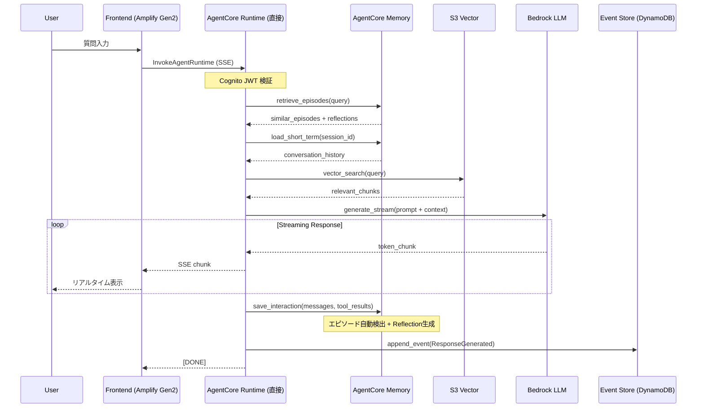
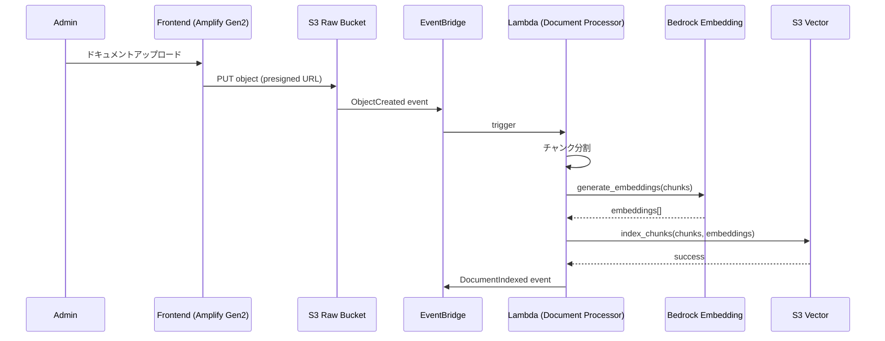

# システムアーキテクチャ

## 1. 全体構成図

```
┌──────────────────────────────────────────────────────────────────────────────────────┐
│                                    AWS Cloud                                          │
├──────────────────────────────────────────────────────────────────────────────────────┤
│                                                                                      │
│  ┌─────────────────────────────────────────────────────────────────────────────────┐│
│  │                         Frontend (Amplify Gen2)                                  ││
│  │  ┌─────────────┐    ┌─────────────┐    ┌─────────────────────────────────────┐  ││
│  │  │   Route53   │───>│ CloudFront  │───>│         Amplify Hosting             │  ││
│  │  │             │    │   (CDN)     │    │       Next.js 15 Static Export      │  ││
│  │  └─────────────┘    └─────────────┘    └─────────────────────────────────────┘  ││
│  │                                                                                  ││
│  │  特徴:                                                                           ││
│  │  - CodePipeline連携による自動CI/CD                                               ││
│  │  - ブランチごとのプレビュー環境                                                   ││
│  │  - カスタムドメイン + 自動SSL                                                    ││
│  └─────────────────────────────────────────────────────────────────────────────────┘│
│                                         │                                            │
│                                         │ HTTPS (SSE/WebSocket)                      │
│                                         │ ※ AgentCore Runtime へ直接接続            │
│                                         ▼                                            │
│  ┌─────────────────────────────────────────────────────────────────────────────────┐│
│  │                         AgentCore Runtime                                        ││
│  │                                                                                  ││
│  │  ┌─────────────────────────────────────────────────────────────────────────┐    ││
│  │  │                    ECR Container Image                                   │    ││
│  │  │                                                                          │    ││
│  │  │   ┌─────────────────────────────────────────────────────────────────┐   │    ││
│  │  │   │                 Python Agent Application                         │   │    ││
│  │  │   │                                                                  │   │    ││
│  │  │   │   Framework: Strands Agents                                     │   │    ││
│  │  │   │   SDK: bedrock-agentcore-sdk-python                             │   │    ││
│  │  │   │   Architecture: Clean Architecture + CQRS + Event Sourcing      │   │    ││
│  │  │   │                                                                  │   │    ││
│  │  │   │   @app.entrypoint                                               │   │    ││
│  │  │   │   async def invoke(payload):                                    │   │    ││
│  │  │   │       async for chunk in agent.stream_async(prompt):            │   │    ││
│  │  │   │           yield chunk                                           │   │    ││
│  │  │   └─────────────────────────────────────────────────────────────────┘   │    ││
│  │  └─────────────────────────────────────────────────────────────────────────┘    ││
│  │                                                                                  ││
│  │  特徴:                                                                           ││
│  │  - セッション分離（各ユーザー専用のmicroVM隔離環境）                              ││
│  │  - サーバーレス・自動スケーリング（スケールゼロ対応）                             ││
│  │  - 双方向ストリーミング（HTTP API + WebSocket）                                 ││
│  │  - Long-running agents 対応（最大8時間）                                        ││
│  │  - 100MBペイロード対応（マルチモーダル）                                          ││
│  │  - InvokeAgentRuntime API で直接呼び出し                                        ││
│  └─────────────────────────────────────────────────────────────────────────────────┘│
│                                         │                                            │
│           ┌─────────────────────────────┼─────────────────────────────┐              │
│           │                             │                             │              │
│           ▼                             ▼                             ▼              │
│  ┌─────────────────┐      ┌─────────────────────┐      ┌─────────────────────┐      │
│  │ AgentCore       │      │   AgentCore Memory  │      │ AgentCore           │      │
│  │ Identity        │      │                     │      │ Observability       │      │
│  │                 │      │  ┌───────────────┐  │      │                     │      │
│  │ ┌─────────────┐ │      │  │ Short-term    │  │      │ ┌─────────────────┐ │      │
│  │ │Cognito      │ │      │  │ Memory        │  │      │ │ CloudWatch      │ │      │
│  │ │User Pool    │ │      │  │ (Session)     │  │      │ │ Logs & Metrics  │ │      │
│  │ └─────────────┘ │      │  └───────────────┘  │      │ └─────────────────┘ │      │
│  │ ┌─────────────┐ │      │  ┌───────────────┐  │      │ ┌─────────────────┐ │      │
│  │ │OAuth2       │ │      │  │ Episodic      │  │      │ │ X-Ray           │ │      │
│  │ │Providers    │ │      │  │ Memory        │  │      │ │ Distributed     │ │      │
│  │ │             │ │      │  │ (体験学習)    │  │      │ │ Tracing         │ │      │
│  │ └─────────────┘ │      │  └───────────────┘  │      │ └─────────────────┘ │      │
│  │ ┌─────────────┐ │      │  ┌───────────────┐  │      │ ┌─────────────────┐ │      │
│  │ │Token Vault  │ │      │  │ Semantic      │  │      │ │ Agent           │ │      │
│  │ │(Secure)     │ │      │  │ Memory        │  │      │ │ Dashboards      │ │      │
│  │ └─────────────┘ │      │  │ (Facts)       │  │      │ └─────────────────┘ │      │
│  │                 │      │  └───────────────┘  │      │                     │      │
│  │                 │      │  ┌───────────────┐  │      │                     │      │
│  │                 │      │  │ Reflections   │  │      │                     │      │
│  │                 │      │  │ (洞察抽出)    │  │      │                     │      │
│  │                 │      │  └───────────────┘  │      │                     │      │
│  └─────────────────┘      └─────────────────────┘      └─────────────────────┘      │
│                                                                                      │
│  ┌─────────────────────────────────────────────────────────────────────────────────┐│
│  │                              Tool Layer                                          ││
│  │                                                                                  ││
│  │  ┌───────────────────┐  ┌───────────────────┐  ┌───────────────────┐            ││
│  │  │  Lambda Functions │  │    S3 Vector      │  │    DynamoDB       │            ││
│  │  │  (Business Tools) │  │  (Knowledge Base) │  │  (Event Store)    │            ││
│  │  │                   │  │                   │  │                   │            ││
│  │  │  - CRM Tool       │  │  - Vector Index   │  │  - Events Table   │            ││
│  │  │  - Order Tool     │  │  - Semantic Search│  │  - Read Models    │            ││
│  │  │  - Document Tool  │  │  - Chunk Storage  │  │  - Projections    │            ││
│  │  └───────────────────┘  └───────────────────┘  └───────────────────┘            ││
│  │                                                                                  ││
│  │  ┌───────────────────┐  ┌───────────────────┐  ┌───────────────────┐            ││
│  │  │ AgentCore Code    │  │  AgentCore        │  │   S3 Buckets      │            ││
│  │  │ Interpreter       │  │  Browser          │  │                   │            ││
│  │  │                   │  │                   │  │  - Raw Documents  │            ││
│  │  │  - Python/JS実行  │  │  - Web自動化      │  │  - Processed      │            ││
│  │  │  - 隔離環境       │  │  - スクレイピング │  │  - Embeddings     │            ││
│  │  └───────────────────┘  └───────────────────┘  └───────────────────┘            ││
│  └─────────────────────────────────────────────────────────────────────────────────┘│
│                                                                                      │
│  ┌─────────────────────────────────────────────────────────────────────────────────┐│
│  │                           External Integrations                                  ││
│  │                                                                                  ││
│  │  ┌───────────────────┐  ┌───────────────────┐                                   ││
│  │  │  EventBridge      │  │   External APIs   │                                   ││
│  │  │  (Domain Events)  │  │                   │                                   ││
│  │  │                   │  │  - Slack          │                                   ││
│  │  │  - Event Bus      │  │  - GitHub         │                                   ││
│  │  │  - Event Rules    │  │  - Salesforce     │                                   ││
│  │  └───────────────────┘  └───────────────────┘                                   ││
│  └─────────────────────────────────────────────────────────────────────────────────┘│
│                                                                                      │
└──────────────────────────────────────────────────────────────────────────────────────┘
```

## 2. AgentCore Runtime 直接接続アーキテクチャ

### 2.1 なぜ AgentCore Gateway を使わないのか

| 観点 | Gateway経由 | Runtime直接接続 |
|------|-------------|-----------------|
| **ストリーミング** | Gateway→Runtimeの二段構成 | 直接SSE/WebSocket |
| **レイテンシ** | 中継のオーバーヘッド | 最小レイテンシ |
| **構成の複雑さ** | Gateway設定が必要 | シンプル |
| **Tool管理** | Gateway側でMCP Tool化 | Runtime内でStrands Tools定義 |
| **適用ケース** | 複数API/Toolの統合管理 | 単一エージェントRAG |

**本プロジェクトの選択: Runtime直接接続**

理由:
- シンプルなRAGチャットエージェント構成
- AgentCore Runtime が SSE/WebSocket を直接サポート（2025年12月 双方向ストリーミング対応）
- Tools は Strands Agents の `@tool` デコレータで定義（Gateway不要）
- Lambda Functions は Agent内から直接呼び出し可能

### 2.2 ストリーミング通信フロー

```
┌─────────────────────────────────────────────────────────────────────────────────────┐
│                        Streaming Communication Architecture                          │
├─────────────────────────────────────────────────────────────────────────────────────┤
│                                                                                     │
│   ┌─────────────┐    SSE/WebSocket      ┌─────────────────────────────────────┐    │
│   │   Browser   │◄──────────────────────►│       AgentCore Runtime             │    │
│   │   (Next.js) │     直接接続           │                                     │    │
│   │             │                        │  InvokeAgentRuntime API             │    │
│   │  Features:  │                        │  - HTTP API (SSE Streaming)         │    │
│   │  - TanStack │                        │  - WebSocket (双方向ストリーミング)  │    │
│   │    Query    │                        │                                     │    │
│   │  - Streaming│                        │  @app.entrypoint                    │    │
│   │    Hooks    │                        │  async def invoke(payload):         │    │
│   └─────────────┘                        │      async for chunk in agent...    │    │
│         │                                │          yield chunk                │    │
│         │ Cognito JWT                    └─────────────────────────────────────┘    │
│         ▼                                                                           │
│   ┌─────────────────────────────────────────────────────────────────────────────┐  │
│   │                         Amplify Gen2 (認証)                                  │  │
│   │                                                                              │  │
│   │   amplify/auth/resource.ts → Cognito User Pool                              │  │
│   │   JWT Token → AgentCore Identity で検証                                      │  │
│   └─────────────────────────────────────────────────────────────────────────────┘  │
│                                                                                     │
└─────────────────────────────────────────────────────────────────────────────────────┘
```

### 2.3 Amplify Gen2 プロジェクト構成

```
frontend/
├── amplify/
│   ├── auth/
│   │   └── resource.ts          # Cognito User Pool 定義
│   └── backend.ts               # Backend 統合定義
├── src/
│   ├── app/                     # Next.js App Router
│   ├── features/
│   │   └── chat/
│   │       ├── api/
│   │       │   └── agentcore-client.ts   # AgentCore Runtime 直接呼び出し
│   │       ├── hooks/
│   │       │   └── use-chat-stream.ts
│   │       └── components/
│   └── shared/
│       └── lib/
│           └── amplify-config.ts
├── amplify.yml                  # Amplify build settings
└── package.json
```

### 2.4 AgentCore Runtime 直接呼び出し実装

```typescript
// features/chat/api/agentcore-client.ts
import { fetchAuthSession } from 'aws-amplify/auth';

const AGENTCORE_RUNTIME_ENDPOINT = process.env.NEXT_PUBLIC_AGENTCORE_RUNTIME_ENDPOINT;

export async function invokeAgentStream(prompt: string, sessionId: string) {
  const { tokens } = await fetchAuthSession();
  const accessToken = tokens?.accessToken?.toString();

  // AgentCore Runtime InvokeAgentRuntime API を直接呼び出し
  const response = await fetch(`${AGENTCORE_RUNTIME_ENDPOINT}/invoke`, {
    method: 'POST',
    headers: {
      'Content-Type': 'application/json',
      'Authorization': `Bearer ${accessToken}`,
      'X-Session-Id': sessionId,
    },
    body: JSON.stringify({ prompt }),
  });

  if (!response.ok) {
    throw new Error(`AgentCore Runtime error: ${response.status}`);
  }

  return response.body; // ReadableStream for SSE
}
```

## 3. AgentCore Memory（エピソード記憶対応）

### 3.1 Memory Strategy 概要

AgentCore Memory は 2025年12月 re:Invent で **Episodic Memory (エピソード記憶)** が追加されました。

```
┌─────────────────────────────────────────────────────────────────────────────────────┐
│                          AgentCore Memory Strategies                                 │
├─────────────────────────────────────────────────────────────────────────────────────┤
│                                                                                     │
│  ┌─────────────────────────────────────────────────────────────────────────────┐   │
│  │                         Short-term Memory                                    │   │
│  │                                                                              │   │
│  │   用途: セッション内の会話履歴                                                │   │
│  │   保持期間: セッション中                                                      │   │
│  │   データ: ターンごとのメッセージ (USER, ASSISTANT, TOOL)                      │   │
│  └─────────────────────────────────────────────────────────────────────────────┘   │
│                                                                                     │
│  ┌─────────────────────────────────────────────────────────────────────────────┐   │
│  │                         Semantic Memory (Facts)                              │   │
│  │                                                                              │   │
│  │   用途: 静的な事実・ユーザー属性の永続化                                      │   │
│  │   保持期間: 永続                                                              │   │
│  │   データ: 抽出された事実 (名前、好み、設定など)                               │   │
│  │   検索: セマンティック検索によるクエリベースの取得                            │   │
│  └─────────────────────────────────────────────────────────────────────────────┘   │
│                                                                                     │
│  ┌─────────────────────────────────────────────────────────────────────────────┐   │
│  │                    【NEW】 Episodic Memory (エピソード記憶)                   │   │
│  │                                                                              │   │
│  │   用途: 過去のインタラクションから「体験」を学習                              │   │
│  │   保持期間: 永続                                                              │   │
│  │                                                                              │   │
│  │   ┌───────────────────────────────────────────────────────────────────────┐ │   │
│  │   │  Episode (エピソード)                                                  │ │   │
│  │   │                                                                        │ │   │
│  │   │  意味のあるインタラクションの「スライス」を自動検出・保存               │ │   │
│  │   │                                                                        │ │   │
│  │   │  構成要素:                                                             │ │   │
│  │   │  - Situation (状況): 何が起きたか                                      │ │   │
│  │   │  - Intent (意図): ユーザーが何を達成しようとしたか                      │ │   │
│  │   │  - Assessment (評価): 結果の成否                                       │ │   │
│  │   │  - Justification (根拠): なぜその結果になったか                        │ │   │
│  │   │  - Episode Reflection (振り返り): エピソードレベルの洞察               │ │   │
│  │   └───────────────────────────────────────────────────────────────────────┘ │   │
│  │                                                                              │   │
│  │   例:                                                                        │   │
│  │   - コードデプロイでエラー発生→代替アプローチで解決した体験                  │   │
│  │   - 予約変更タスクでTool選択→成功した体験                                    │   │
│  │   - データ処理で最適パラメータを発見した体験                                  │   │
│  └─────────────────────────────────────────────────────────────────────────────┘   │
│                                                                                     │
│  ┌─────────────────────────────────────────────────────────────────────────────┐   │
│  │                    【NEW】 Reflections (洞察・パターン抽出)                   │   │
│  │                                                                              │   │
│  │   用途: 複数のエピソードを分析してパターン・ベストプラクティスを抽出          │   │
│  │                                                                              │   │
│  │   抽出される洞察:                                                            │   │
│  │   - 成功パターン: どのTool組み合わせが特定タスクで成功するか                 │   │
│  │   - 失敗パターン: 共通の失敗モードとその解決アプローチ                       │   │
│  │   - ベストプラクティス: 類似シナリオでの最適な手順                           │   │
│  │                                                                              │   │
│  │   用途:                                                                      │   │
│  │   - 過去の失敗を繰り返さない                                                 │   │
│  │   - 成功戦略を新しいコンテキストに適用                                       │   │
│  │   - エージェントの継続的改善                                                 │   │
│  └─────────────────────────────────────────────────────────────────────────────┘   │
│                                                                                     │
└─────────────────────────────────────────────────────────────────────────────────────┘
```

### 3.2 Episodic Memory 実装

```python
# infrastructure/agentcore/memory_client.py
from bedrock_agentcore.memory import MemoryClient

class AgentCoreMemoryService:
    def __init__(self, region: str):
        self._client = MemoryClient(region_name=region)
        self._memory_id = None
    
    async def create_memory_store(self, name: str) -> str:
        """Memory Store作成（Episodic Strategy含む）"""
        memory = await self._client.create_memory_and_wait(
            name=name,
            description="Agentic RAG memory store with episodic learning",
            strategies=[
                # Semantic Memory (事実)
                {
                    "semanticMemoryStrategy": {
                        "name": "semanticFacts",
                        "namespaces": ["/facts/{actorId}"]
                    }
                },
                # Episodic Memory (体験学習) - NEW
                {
                    "episodicMemoryStrategy": {
                        "name": "episodicLearning",
                        "namespaces": {
                            # Actor単位でエピソードを保存
                            "episodes": "/episodes/{actorId}",
                            # Actor単位で洞察を抽出
                            "reflections": "/reflections/{actorId}"
                        }
                    }
                }
            ]
        )
        self._memory_id = memory.get("id")
        return self._memory_id
    
    async def save_interaction(
        self,
        session_id: str,
        user_id: str,
        messages: list,
        tool_results: list = None
    ) -> None:
        """インタラクションを保存（エピソード自動検出）"""
        formatted_messages = []
        for msg in messages:
            formatted_messages.append((msg.content, msg.role.upper()))
        
        # Tool結果も含めることでエピソード検出精度向上
        if tool_results:
            for result in tool_results:
                formatted_messages.append((str(result), "TOOL"))
        
        await self._client.create_event(
            memory_id=self._memory_id,
            actor_id=user_id,
            session_id=session_id,
            messages=formatted_messages
        )
        # ↑ create_event 実行時に自動的に:
        #   1. エピソード完了を検出
        #   2. エピソードを構造化して保存
        #   3. Reflections (洞察) をバックグラウンドで生成
    
    async def retrieve_relevant_episodes(
        self,
        user_id: str,
        query: str,
        max_results: int = 5
    ) -> list:
        """類似エピソードを検索"""
        episodes = await self._client.retrieve_memories(
            memory_id=self._memory_id,
            namespace=f"/episodes/{user_id}",
            query=query,  # Intent ベースでインデックス化されている
            max_results=max_results
        )
        return episodes
    
    async def retrieve_reflections(
        self,
        user_id: str,
        use_case: str
    ) -> list:
        """洞察・パターンを検索"""
        reflections = await self._client.retrieve_memories(
            memory_id=self._memory_id,
            namespace=f"/reflections/{user_id}",
            query=use_case,  # Use case ベースでインデックス化
        )
        return reflections
```

### 3.3 エピソード記憶の活用パターン

```python
# application/commands/submit_question/handler.py

class SubmitQuestionHandler:
    async def handle_with_episodic_learning(self, command: SubmitQuestionCommand):
        """エピソード記憶を活用した質問応答"""
        
        # 1. 類似の過去エピソードを検索
        similar_episodes = await self._memory_service.retrieve_relevant_episodes(
            user_id=command.user_id,
            query=command.question
        )
        
        # 2. 関連する洞察（Reflections）を検索
        reflections = await self._memory_service.retrieve_reflections(
            user_id=command.user_id,
            use_case=command.question
        )
        
        # 3. エピソードから学んだコンテキストを構築
        episodic_context = self._build_episodic_context(similar_episodes, reflections)
        
        # 4. RAG検索
        rag_context = await self._rag_service.search(
            query=command.question,
            tenant_id=command.tenant_id
        )
        
        # 5. エージェント実行（エピソード + RAG コンテキスト付き）
        response = await self._agent.invoke(
            prompt=command.question,
            context={
                "rag": rag_context,
                "episodes": episodic_context,
                "reflections": reflections
            }
        )
        
        # 6. インタラクションを保存（次回のエピソード検出用）
        await self._memory_service.save_interaction(
            session_id=command.session_id,
            user_id=command.user_id,
            messages=[
                Message(role="user", content=command.question),
                Message(role="assistant", content=response.content)
            ],
            tool_results=response.tool_calls  # Tool結果も保存
        )
        
        return response
    
    def _build_episodic_context(self, episodes: list, reflections: list) -> str:
        """エピソードと洞察からコンテキストを構築"""
        context_parts = []
        
        if episodes:
            context_parts.append("## 過去の類似体験:")
            for ep in episodes[:3]:  # 上位3件
                context_parts.append(f"- 状況: {ep.situation}")
                context_parts.append(f"  結果: {ep.assessment}")
                context_parts.append(f"  学び: {ep.reflection}")
        
        if reflections:
            context_parts.append("\n## 蓄積された洞察:")
            for ref in reflections[:2]:  # 上位2件
                context_parts.append(f"- {ref.insight}")
        
        return "\n".join(context_parts)
```

## 4. データフロー

### 4.1 質問応答フロー（Streaming + Episodic Memory）



### 4.2 ドキュメント登録フロー



## 5. コンポーネント詳細

### 5.1 AgentCore Runtime エンドポイント

```yaml
# AgentCore Runtime 直接呼び出し
endpoints:
  InvokeAgentRuntime:
    - POST /invoke           # SSE ストリーミングレスポンス
    - WebSocket /ws          # 双方向ストリーミング

# 認証
authentication:
  - AWS IAM (SigV4)
  - Cognito JWT Token (via AgentCore Identity)
```

### 5.2 AgentCore Runtime (ECR) 構成

| 項目 | 値 |
|------|-----|
| Base Image | python:3.11-slim |
| Framework | Strands Agents |
| SDK | bedrock-agentcore-sdk-python |
| Model | us.amazon.nova-pro-v1:0 |
| Network | Public (VPC-only coming soon) |
| Max Execution Time | 8 hours |
| Max Payload | 100MB |
| Streaming | SSE + WebSocket (双方向) |

### 5.3 Lambda Functions (Tools)

| Function | 役割 | トリガー | タイムアウト |
|----------|------|---------|-------------|
| customer-tool | 顧客情報取得 | Agent内 @tool | 10s |
| order-tool | 注文情報取得 | Agent内 @tool | 10s |
| document-processor | ドキュメント処理 | EventBridge | 300s |
| projection-handler | リードモデル更新 | DynamoDB Streams | 60s |

### 5.4 DynamoDB テーブル設計

```
Event Store Table
─────────────────────────────────────
PK                      | SK                | Attributes
─────────────────────────────────────
AGENT#agent-001         | v0000000001       | event_type, data, timestamp
SESSION#session-001     | v0000000001       | event_type, data, timestamp

Read Model Table
─────────────────────────────────────
PK                      | SK                | Attributes
─────────────────────────────────────
USER#user-001           | CONV#conv-001     | messages, created_at, updated_at
TENANT#tenant-001       | DOC#doc-001       | title, status, chunks_count

GSI: TenantIndex
─────────────────────────────────────
GSI1PK                  | GSI1SK            | Attributes
─────────────────────────────────────
TENANT#tenant-001       | 2024-01-01T00:00  | all attributes
```

## 6. セキュリティアーキテクチャ

```
┌─────────────────────────────────────────────────────────────────────────────────┐
│                            Security Architecture                                 │
├─────────────────────────────────────────────────────────────────────────────────┤
│                                                                                 │
│  ┌─────────────────────────────────────────────────────────────────────────┐   │
│  │                    Identity Layer (AgentCore Identity)                   │   │
│  │                                                                          │   │
│  │   ┌─────────────┐    ┌─────────────┐    ┌─────────────┐                 │   │
│  │   │  Cognito    │    │   JWT       │    │ Workload    │                 │   │
│  │   │  User Pool  │───>│  Token      │───>│ Identity    │                 │   │
│  │   │  (Amplify)  │    │  Validation │    │ (Agent)     │                 │   │
│  │   └─────────────┘    └─────────────┘    └─────────────┘                 │   │
│  │                                                                          │   │
│  │   ┌─────────────────────────────────────────────────────────────────┐   │   │
│  │   │              Token Vault (Secure Storage)                        │   │   │
│  │   │   - User OAuth tokens                                            │   │   │
│  │   │   - Agent credentials                                            │   │   │
│  │   │   - API keys                                                     │   │   │
│  │   └─────────────────────────────────────────────────────────────────┘   │   │
│  └─────────────────────────────────────────────────────────────────────────┘   │
│                                                                                 │
│  ┌─────────────────────────────────────────────────────────────────────────┐   │
│  │                    Runtime Layer (AgentCore Runtime)                     │   │
│  │                                                                          │   │
│  │   ┌─────────────────────────────────────────────────────────────────┐   │   │
│  │   │              Session Isolation (microVM)                         │   │   │
│  │   │   - 各ユーザーセッションは専用microVMで実行                        │   │   │
│  │   │   - CPU/メモリ/ファイルシステム完全分離                            │   │   │
│  │   │   - セッション終了時にメモリサニタイズ                             │   │   │
│  │   └─────────────────────────────────────────────────────────────────┘   │   │
│  └─────────────────────────────────────────────────────────────────────────┘   │
│                                                                                 │
│  ┌─────────────────────────────────────────────────────────────────────────┐   │
│  │                          Data Layer                                      │   │
│  │                                                                          │   │
│  │   ┌─────────────┐    ┌─────────────┐    ┌─────────────┐                 │   │
│  │   │   KMS       │    │  S3 Bucket  │    │  DynamoDB   │                 │   │
│  │   │ Encryption  │───>│  Policies   │    │  Encryption │                 │   │
│  │   └─────────────┘    └─────────────┘    └─────────────┘                 │   │
│  │                                                                          │   │
│  └─────────────────────────────────────────────────────────────────────────┘   │
│                                                                                 │
└─────────────────────────────────────────────────────────────────────────────────┘
```

### 6.1 マルチテナント分離

```python
# テナント分離の実装（AgentCore Identity連携）
class TenantIsolationPolicy:
    def __init__(self, identity_client: IdentityClient):
        self._identity_client = identity_client
    
    async def validate_access(self, token: str, resource: Resource) -> bool:
        # AgentCore Identityでトークン検証
        claims = await self._identity_client.validate_token(token)
        return claims.tenant_id == resource.tenant_id

# S3Vectorでのテナント分離
class TenantAwareS3Vector:
    def search(self, query: str, tenant_id: str) -> List[Chunk]:
        return self._client.search(
            query=query,
            filter={"tenant_id": tenant_id}
        )
```

## 7. 可観測性 (AgentCore Observability)

### 7.1 ログ構造

```json
{
  "timestamp": "2024-01-01T00:00:00.000Z",
  "level": "INFO",
  "trace_id": "abc-123",
  "span_id": "def-456",
  "tenant_id": "tenant-001",
  "user_id": "user-001",
  "session_id": "session-001",
  "event": "response_generated",
  "agent_step": "tool_invocation",
  "tool_name": "search_knowledge",
  "metrics": {
    "tokens_used": 1500,
    "latency_ms": 850,
    "chunks_retrieved": 5,
    "episodes_retrieved": 2,
    "reflections_used": 1
  }
}
```

### 7.2 メトリクス（CloudWatch Dashboard）

| メトリクス | 説明 | アラート閾値 |
|-----------|------|-------------|
| `latency_p95` | P95レスポンス時間 | > 2000ms |
| `error_rate` | エラー率 | > 1% |
| `token_usage` | トークン使用量 | > 100k/hour |
| `session_count` | アクティブセッション数 | - |
| `tool_invocation_count` | Tool呼び出し回数 | - |
| `memory_retrieval_latency` | メモリ取得レイテンシ | > 500ms |
| `episode_detection_count` | エピソード検出数 | - |
| `reflection_generation_count` | 洞察生成数 | - |

### 7.3 分散トレーシング（X-Ray）

```
Transaction Search 有効化:
- Trace Segment Destination: CloudWatch Logs
- Sampling: 1% (本番) / 100% (開発)

トレース対象:
- Agent invocation
- Tool calls (Lambda, S3Vector)
- Memory operations (short-term, episodic, semantic)
- Model inference
- Episode detection
```

## 8. デプロイメントアーキテクチャ (CodePipeline/CodeDeploy)

```
┌─────────────────────────────────────────────────────────────────────────────────┐
│                     Deployment Architecture (AWS CI/CD)                          │
├─────────────────────────────────────────────────────────────────────────────────┤
│                                                                                 │
│  ┌─────────────────────────────────────────────────────────────────────────┐   │
│  │                          GitHub Repository                               │   │
│  │                                                                          │   │
│  │   ┌─────────────┐    ┌─────────────┐    ┌─────────────┐                 │   │
│  │   │  frontend/  │    │  backend/   │    │infrastructure│                │   │
│  │   │  (Next.js)  │    │  (Python)   │    │   (CDK)     │                 │   │
│  │   └──────┬──────┘    └──────┬──────┘    └──────┬──────┘                 │   │
│  └──────────│───────────────────│─────────────────│─────────────────────────┘   │
│             │                   │                 │                             │
│             │ Webhook           │ Webhook         │ Webhook                     │
│             ▼                   ▼                 ▼                             │
│  ┌─────────────────────────────────────────────────────────────────────────┐   │
│  │                         AWS CodePipeline                                 │   │
│  │                                                                          │   │
│  │  ┌─────────────────┐  ┌─────────────────┐  ┌─────────────────┐          │   │
│  │  │ Frontend        │  │ Backend         │  │ Infrastructure  │          │   │
│  │  │ Pipeline        │  │ Pipeline        │  │ Pipeline        │          │   │
│  │  └────────┬────────┘  └────────┬────────┘  └────────┬────────┘          │   │
│  └───────────│────────────────────│───────────────────│─────────────────────┘   │
│              │                    │                   │                         │
│              ▼                    ▼                   ▼                         │
│  ┌─────────────────┐  ┌─────────────────┐  ┌─────────────────┐                 │
│  │ CodeBuild       │  │ CodeBuild       │  │ CodeBuild       │                 │
│  │                 │  │                 │  │                 │                 │
│  │ - npm run build │  │ - Docker build  │  │ - cdk synth     │                 │
│  │ - Static Export │  │ - Push to ECR   │  │ - cdk deploy    │                 │
│  │                 │  │ - agentcore     │  │                 │                 │
│  │                 │  │   launch        │  │                 │                 │
│  └────────┬────────┘  └────────┬────────┘  └────────┬────────┘                 │
│           │                    │                    │                           │
│           ▼                    ▼                    ▼                           │
│  ┌─────────────────┐  ┌─────────────────┐  ┌─────────────────┐                 │
│  │ Amplify Hosting │  │ AgentCore       │  │ AWS Resources   │                 │
│  │ (Frontend)      │  │ Runtime (ECR)   │  │ (CDK Managed)   │                 │
│  │                 │  │                 │  │                 │                 │
│  │ - CloudFront    │  │ - Agent         │  │ - DynamoDB      │                 │
│  │ - S3            │  │   Endpoint      │  │ - S3 Buckets    │                 │
│  │ - Cognito       │  │                 │  │ - Lambda Tools  │                 │
│  └─────────────────┘  └─────────────────┘  └─────────────────┘                 │
│                                                                                 │
└─────────────────────────────────────────────────────────────────────────────────┘
```

### 8.1 CodePipeline 構成

```yaml
# buildspec.yml (Backend)
version: 0.2
phases:
  install:
    runtime-versions:
      python: 3.11
    commands:
      - pip install uv
      - pip install bedrock-agentcore-starter-toolkit
  
  pre_build:
    commands:
      - cd backend
      - uv sync --all-extras
      - uv run pytest
      - uv run ruff check src
      - uv run mypy src
  
  build:
    commands:
      - agentcore configure --entrypoint agent.py
      - agentcore launch
  
  post_build:
    commands:
      - agentcore status
      - echo "Agent deployed successfully"
```

```yaml
# buildspec.yml (Frontend)
version: 0.2
phases:
  install:
    runtime-versions:
      nodejs: 20
    commands:
      - npm ci
  
  pre_build:
    commands:
      - npm run lint
      - npm run test
  
  build:
    commands:
      - npm run build
  
artifacts:
  base-directory: out
  files:
    - '**/*'
```

## 9. 環境構成

| 環境 | Frontend | Backend | 用途 |
|------|----------|---------|------|
| Development | Amplify Preview | AgentCore (dev) | 開発・検証 |
| Staging | Amplify (staging branch) | AgentCore (staging) | QA・受入テスト |
| Production | Amplify (main branch) | AgentCore (prod) | 本番 |

## 10. AgentCore Memory エピソード記憶 実装計画

### 10.1 実装フェーズ

```
┌─────────────────────────────────────────────────────────────────────────────────────┐
│                    Episodic Memory Implementation Roadmap                            │
├─────────────────────────────────────────────────────────────────────────────────────┤
│                                                                                     │
│  Phase 1: 基盤構築 (Week 1-2)                                                       │
│  ┌───────────────────────────────────────────────────────────────────────────────┐ │
│  │ □ AgentCore Memory Store 作成 (Episodic Strategy 有効化)                      │ │
│  │ □ Memory Client 実装 (infrastructure/agentcore/memory_client.py)             │ │
│  │ □ Session Memory (Short-term) 統合                                           │ │
│  │ □ 基本的な create_event / retrieve_memories API 疎通確認                      │ │
│  └───────────────────────────────────────────────────────────────────────────────┘ │
│                                         │                                           │
│                                         ▼                                           │
│  Phase 2: エピソード記憶統合 (Week 3-4)                                             │
│  ┌───────────────────────────────────────────────────────────────────────────────┐ │
│  │ □ Tool結果を含むインタラクション保存の実装                                     │ │
│  │ □ エピソード自動検出の検証（complete episode detection）                       │ │
│  │ □ 類似エピソード検索 (retrieve_relevant_episodes) 実装                        │ │
│  │ □ エピソードコンテキストのプロンプト注入                                       │ │
│  └───────────────────────────────────────────────────────────────────────────────┘ │
│                                         │                                           │
│                                         ▼                                           │
│  Phase 3: Reflections 統合 (Week 5-6)                                               │
│  ┌───────────────────────────────────────────────────────────────────────────────┐ │
│  │ □ Reflections namespace 設定                                                  │ │
│  │ □ 洞察検索 (retrieve_reflections) 実装                                        │ │
│  │ □ Reflection をエージェント判断に組み込み                                      │ │
│  │ □ 成功/失敗パターンの活用ロジック実装                                          │ │
│  └───────────────────────────────────────────────────────────────────────────────┘ │
│                                         │                                           │
│                                         ▼                                           │
│  Phase 4: 最適化・本番化 (Week 7-8)                                                 │
│  ┌───────────────────────────────────────────────────────────────────────────────┐ │
│  │ □ マルチテナント対応 (tenant_id による namespace 分離)                         │ │
│  │ □ パフォーマンスチューニング (検索件数、コンテキストサイズ)                     │ │
│  │ □ Observability 統合 (エピソード検出数、Reflection生成数のメトリクス)          │ │
│  │ □ 本番環境デプロイ・モニタリング設定                                           │ │
│  └───────────────────────────────────────────────────────────────────────────────┘ │
│                                                                                     │
└─────────────────────────────────────────────────────────────────────────────────────┘
```

### 10.2 実装タスク詳細

#### Phase 1: 基盤構築

| タスク | ファイル | 説明 | 優先度 |
|-------|---------|------|--------|
| Memory Store 作成 | `infrastructure/lib/memory-stack.ts` | CDKでAgentCore Memory Storeをプロビジョニング | P0 |
| Memory Client | `backend/src/infrastructure/agentcore/memory_client.py` | Memory API のラッパークライアント実装 | P0 |
| DI Container 統合 | `backend/src/infrastructure/config/di_container.py` | MemoryService を DI コンテナに登録 | P0 |
| Session Memory | `backend/src/infrastructure/agentcore/session_memory.py` | Short-term memory の read/write 実装 | P1 |

```python
# infrastructure/lib/memory-stack.ts (CDK)
import * as cdk from 'aws-cdk-lib';
import { Construct } from 'constructs';

export class MemoryStack extends cdk.Stack {
  constructor(scope: Construct, id: string, props?: cdk.StackProps) {
    super(scope, id, props);

    // AgentCore Memory Store は CLI または SDK で作成
    // CDK Custom Resource で agentcore CLI を実行
    new cdk.CustomResource(this, 'AgentCoreMemoryStore', {
      serviceToken: memoryProviderLambda.functionArn,
      properties: {
        name: 'agentic-rag-memory',
        strategies: [
          { type: 'semantic', name: 'semanticFacts' },
          { type: 'episodic', name: 'episodicLearning' }
        ]
      }
    });
  }
}
```

#### Phase 2: エピソード記憶統合

| タスク | ファイル | 説明 | 優先度 |
|-------|---------|------|--------|
| Tool結果保存 | `backend/src/infrastructure/agentcore/memory_client.py` | Tool call結果をインタラクションに含める | P0 |
| エピソード検索 | `backend/src/infrastructure/agentcore/episodic_memory.py` | Intent ベースの類似エピソード検索 | P0 |
| Context Builder | `backend/src/application/services/context_builder.py` | エピソード→プロンプトコンテキスト変換 | P1 |
| Handler 統合 | `backend/src/application/commands/submit_question/handler.py` | SubmitQuestionHandler にエピソード検索を統合 | P1 |

```python
# backend/src/infrastructure/agentcore/episodic_memory.py
from dataclasses import dataclass
from typing import List, Optional

@dataclass
class Episode:
    """エピソード記憶のデータ構造"""
    id: str
    situation: str      # 何が起きたか
    intent: str         # ユーザーの意図
    assessment: str     # 成功/失敗の評価
    justification: str  # 理由
    reflection: str     # エピソードレベルの洞察
    tools_used: List[str]
    timestamp: str

class EpisodicMemoryService:
    """エピソード記憶の検索・活用サービス"""
    
    def __init__(self, memory_client: MemoryClient, memory_id: str):
        self._client = memory_client
        self._memory_id = memory_id
    
    async def retrieve_similar_episodes(
        self,
        user_id: str,
        query: str,
        max_results: int = 3
    ) -> List[Episode]:
        """
        類似のエピソードを検索
        
        Intent ベースでインデックス化されているため、
        ユーザーの質問意図に近い過去の体験を取得可能
        """
        raw_episodes = await self._client.retrieve_memories(
            memory_id=self._memory_id,
            namespace=f"/episodes/{user_id}",
            query=query,
            max_results=max_results
        )
        
        return [self._parse_episode(ep) for ep in raw_episodes]
    
    async def save_interaction_for_episode_detection(
        self,
        session_id: str,
        user_id: str,
        user_message: str,
        assistant_response: str,
        tool_calls: List[dict]
    ) -> None:
        """
        インタラクションを保存し、エピソード自動検出をトリガー
        
        AgentCore Memory が自動的に:
        1. エピソード完了を検出
        2. エピソードを構造化
        3. Reflections をバックグラウンド生成
        """
        messages = [
            (user_message, "USER"),
            (assistant_response, "ASSISTANT"),
        ]
        
        # Tool結果も含めることでエピソード検出精度向上
        for tool in tool_calls:
            messages.append((
                f"Tool: {tool['name']}, Result: {tool['result'][:500]}",
                "TOOL"
            ))
        
        await self._client.create_event(
            memory_id=self._memory_id,
            actor_id=user_id,
            session_id=session_id,
            messages=messages
        )
    
    def _parse_episode(self, raw: dict) -> Episode:
        """AgentCore Memory のレスポンスを Episode に変換"""
        return Episode(
            id=raw.get("id", ""),
            situation=raw.get("situation", ""),
            intent=raw.get("intent", ""),
            assessment=raw.get("assessment", ""),
            justification=raw.get("justification", ""),
            reflection=raw.get("episode_reflection", ""),
            tools_used=raw.get("tools_used", []),
            timestamp=raw.get("timestamp", "")
        )
```

#### Phase 3: Reflections 統合

| タスク | ファイル | 説明 | 優先度 |
|-------|---------|------|--------|
| Reflection 検索 | `backend/src/infrastructure/agentcore/reflection_service.py` | Use case ベースの洞察検索 | P0 |
| パターン適用 | `backend/src/application/services/pattern_applicator.py` | 成功/失敗パターンをエージェント判断に適用 | P1 |
| System Prompt 拡張 | `backend/src/presentation/entrypoint/prompts.py` | Reflection を含むシステムプロンプト生成 | P1 |

```python
# backend/src/infrastructure/agentcore/reflection_service.py
from dataclasses import dataclass
from typing import List

@dataclass
class Reflection:
    """Reflection（洞察）のデータ構造"""
    id: str
    use_case: str           # どのようなユースケースに適用可能か
    insight: str            # 抽出された洞察
    success_patterns: List[str]  # 成功パターン
    failure_patterns: List[str]  # 失敗パターン
    best_practices: List[str]    # ベストプラクティス

class ReflectionService:
    """Reflections（洞察）の検索・活用サービス"""
    
    async def retrieve_relevant_reflections(
        self,
        user_id: str,
        use_case: str,
        max_results: int = 2
    ) -> List[Reflection]:
        """
        関連する洞察を検索
        
        複数のエピソードから抽出されたパターンを取得
        """
        raw_reflections = await self._client.retrieve_memories(
            memory_id=self._memory_id,
            namespace=f"/reflections/{user_id}",
            query=use_case,
            max_results=max_results
        )
        
        return [self._parse_reflection(ref) for ref in raw_reflections]
    
    def build_reflection_prompt(self, reflections: List[Reflection]) -> str:
        """
        Reflection をシステムプロンプトに組み込む形式に変換
        """
        if not reflections:
            return ""
        
        lines = ["## 過去の学習から得られた洞察:"]
        for ref in reflections:
            lines.append(f"\n### {ref.use_case}")
            lines.append(f"洞察: {ref.insight}")
            
            if ref.success_patterns:
                lines.append("成功パターン:")
                for pattern in ref.success_patterns[:2]:
                    lines.append(f"  - {pattern}")
            
            if ref.best_practices:
                lines.append("ベストプラクティス:")
                for practice in ref.best_practices[:2]:
                    lines.append(f"  - {practice}")
        
        return "\n".join(lines)
```

#### Phase 4: 最適化・本番化

| タスク | ファイル | 説明 | 優先度 |
|-------|---------|------|--------|
| マルチテナント | `backend/src/infrastructure/agentcore/tenant_memory.py` | テナント別 namespace 分離 | P0 |
| メトリクス追加 | `backend/src/infrastructure/observability/metrics.py` | エピソード関連メトリクス | P1 |
| パフォーマンス設定 | `backend/src/infrastructure/config/memory_config.py` | 検索件数、キャッシュ設定 | P1 |
| 運用ダッシュボード | `infrastructure/lib/dashboard-stack.ts` | CloudWatch Dashboard 追加 | P2 |

```python
# backend/src/infrastructure/config/memory_config.py
from pydantic_settings import BaseSettings

class MemoryConfig(BaseSettings):
    """エピソード記憶の設定"""
    
    # Memory Store ID
    memory_store_id: str
    
    # エピソード検索設定
    max_episodes_per_query: int = 3
    episode_context_max_chars: int = 2000
    
    # Reflection 検索設定
    max_reflections_per_query: int = 2
    reflection_context_max_chars: int = 1000
    
    # マルチテナント設定
    enable_tenant_isolation: bool = True
    tenant_namespace_prefix: str = "/tenant"
    
    # パフォーマンス設定
    enable_memory_cache: bool = True
    cache_ttl_seconds: int = 300
    
    class Config:
        env_prefix = "AGENTCORE_MEMORY_"
```

### 10.3 テスト計画

```python
# tests/integration/test_episodic_memory.py
import pytest
from src.infrastructure.agentcore.episodic_memory import EpisodicMemoryService

class TestEpisodicMemory:
    """エピソード記憶の統合テスト"""
    
    @pytest.mark.asyncio
    async def test_episode_detection_on_task_completion(
        self,
        memory_service: EpisodicMemoryService,
        sample_conversation: list
    ):
        """タスク完了時にエピソードが自動検出されること"""
        # Given: 一連の会話（質問→Tool使用→回答）
        for msg in sample_conversation:
            await memory_service.save_interaction_for_episode_detection(
                session_id="test-session",
                user_id="test-user",
                user_message=msg["user"],
                assistant_response=msg["assistant"],
                tool_calls=msg.get("tools", [])
            )
        
        # When: 類似エピソードを検索
        episodes = await memory_service.retrieve_similar_episodes(
            user_id="test-user",
            query="同様の質問"
        )
        
        # Then: エピソードが検出されていること
        assert len(episodes) > 0
        assert episodes[0].situation is not None
        assert episodes[0].assessment in ["SUCCESS", "FAILURE", "PARTIAL"]
    
    @pytest.mark.asyncio
    async def test_reflection_generation_after_multiple_episodes(
        self,
        reflection_service: ReflectionService
    ):
        """複数エピソード後にReflectionが生成されること"""
        # Given: 複数のエピソードが蓄積済み
        
        # When: Reflectionを検索
        reflections = await reflection_service.retrieve_relevant_reflections(
            user_id="test-user",
            use_case="顧客問い合わせ対応"
        )
        
        # Then: 洞察が抽出されていること
        assert len(reflections) > 0
        assert reflections[0].insight is not None
```

### 10.4 成功指標 (KPI)

| 指標 | 目標値 | 測定方法 |
|-----|-------|---------|
| エピソード検出率 | > 80% | 完了タスクに対するエピソード生成数 |
| 類似エピソード活用率 | > 60% | エピソードがプロンプトに含まれた応答の割合 |
| Reflection 生成数 | > 10/週 | 週次のReflection生成数 |
| 応答品質向上 | +15% | ユーザーフィードバックスコア (エピソード活用前後比較) |
| 同一エラー再発率 | -30% | 過去に失敗したパターンの再発率 |
