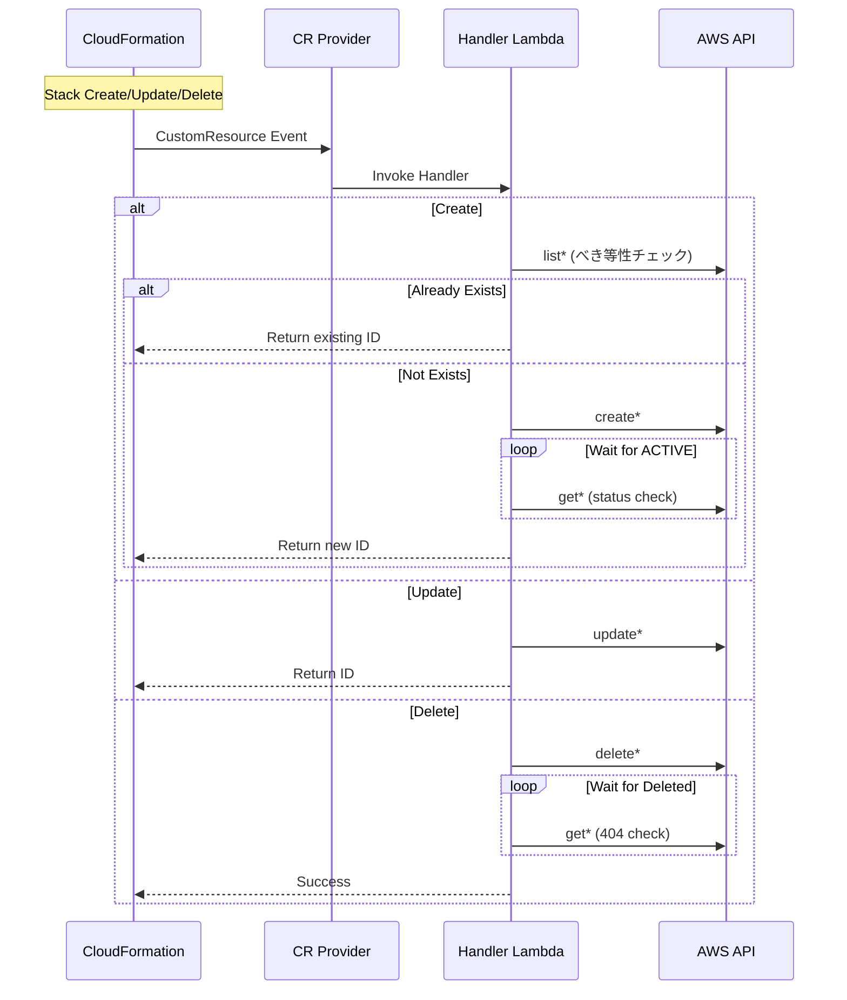

# IaC Custom Resource 設計計画書

**作成日**: 2025年12月10日  
**ステータス**: ✅ 実装完了  
**関連ADR**: [002-use-amplify-gen2.md](../../02-architecture/adr/002-use-amplify-gen2.md)

---

## 1. 概要

### 1.1 背景・課題

現在のインフラ構成では、CDK（CloudFormation）で管理されるリソースと、boto3スクリプトで手動管理されるリソースが混在しており、IaC（Infrastructure as Code）の観点で以下の問題が発生しています。

#### 現状のリソース管理状況

| 管理方式 | 対象リソース | 状態管理 |
|---------|-------------|---------|
| **CDK (CloudFormation)** | ECR, DynamoDB, S3, IAM Role, AgentCore Runtime (L2) | Stack State |
| **boto3スクリプト** | Memory Store, Runtime Endpoint, Gateway, Knowledge Base | SSM Parameter依存 |

#### 問題点

1. **状態管理の分断**
   - CDKはCloudFormation Stackで状態管理
   - boto3スクリプトはSSMパラメータに依存、CloudFormation外で管理
   - ドリフト検出が不可能

2. **べき等性・再現性の問題**
   - boto3スクリプトは「既存チェック」をしているが、完全なべき等性がない
   - スクリプト実行順序に依存
   - 新環境構築時に手順書依存

3. **heredocでのインライン実行**
   - `redeploy-agentcore.sh` でEOFヒアドキュメントでPythonコードをインライン実行
   - テスト・デバッグが困難
   - バージョン管理・変更追跡が困難

4. **Custom Resourceの不完全実装**
   - `memory-stack.ts` のCustom Resourceはプレースホルダー値を返している
   - 実際のAgentCore APIを呼び出していない

### 1.2 目的

- **全リソースのCloudFormation一元管理**
- **TypeScriptへの言語統一** (CDKとの一貫性)
- **完全なIaC実現** (ドリフト検出、状態管理、再現性)
- **boto3スクリプトの廃止**

---

## 2. 設計方針

### 2.1 技術選定

| 項目 | 選定 | 理由 |
|------|-----|------|
| **CDK言語** | TypeScript | 既存CDKスタックとの一貫性 |
| **Custom Resource実装** | TypeScript Lambda | 型安全性、テスト容易性 |
| **バンドル** | esbuild (aws-lambda-nodejs) | 自動バンドル、最小化 |
| **シンプルなAPI呼び出し** | AwsCustomResource | Lambda不要で直接API呼び出し |

### 2.2 アプローチ選択基準

```
┌─────────────────────────────────────────────────────────────┐
│                   API呼び出しが必要                         │
└─────────────────────────────────────────────────────────────┘
                            │
                            ▼
              ┌─────────────────────────────┐
              │  待機処理・べき等性チェック   │
              │  が必要か？                  │
              └─────────────────────────────┘
                     │              │
                    Yes            No
                     │              │
                     ▼              ▼
        ┌─────────────────┐  ┌─────────────────┐
        │ TypeScript      │  │ AwsCustomResource│
        │ Lambda Handler  │  │ (Lambda不要)     │
        └─────────────────┘  └─────────────────┘
```

### 2.3 対象リソースと実装方式

| リソース | 実装方式 | 理由 |
|---------|---------|------|
| **AgentCore Memory** | TypeScript Lambda | ACTIVE待機、べき等性チェック必要 |
| **Knowledge Base** | TypeScript Lambda | ACTIVE待機、Data Source連携必要 |
| **Runtime Endpoint** | TypeScript Lambda | ACTIVE待機必要 |
| **Gateway** | AwsCustomResource | 比較的シンプルなCRUD |

---

## 3. アーキテクチャ

### 3.1 全体構成

```
┌─────────────────────────────────────────────────────────────────┐
│                    CDK Infrastructure (IaC)                     │
├─────────────────────────────────────────────────────────────────┤
│                                                                 │
│  ┌─────────────────┐  ┌─────────────────┐  ┌─────────────────┐ │
│  │  AgenticRag     │  │    ECR Stack    │  │  AgentCore      │ │
│  │  Main Stack     │  │                 │  │  Stack (L2)     │ │
│  │  - DynamoDB     │  │  - Repository   │  │  - Runtime      │ │
│  │  - S3           │  │                 │  │  - IAM Role     │ │
│  │  - KMS          │  │                 │  │  - SSM Params   │ │
│  └─────────────────┘  └─────────────────┘  └─────────────────┘ │
│                                                                 │
│  ┌─────────────────────────────────────────────────────────────┐│
│  │           Custom Resource Constructs (TypeScript)           ││
│  │  ┌──────────────┐ ┌──────────────┐ ┌──────────────────────┐ ││
│  │  │AgentCore     │ │Bedrock       │ │AgentCore             │ ││
│  │  │Memory        │ │KnowledgeBase │ │RuntimeEndpoint       │ ││
│  │  │              │ │              │ │                      │ ││
│  │  │ TS Lambda    │ │ TS Lambda    │ │ TS Lambda            │ ││
│  │  │ Handler      │ │ Handler      │ │ Handler              │ ││
│  │  └──────────────┘ └──────────────┘ └──────────────────────┘ ││
│  └─────────────────────────────────────────────────────────────┘│
│                                                                 │
└─────────────────────────────────────────────────────────────────┘
```

### 3.2 Custom Resource ライフサイクル



---

## 4. ディレクトリ構造

```
infrastructure/
├── bin/
│   └── infrastructure.ts
├── lib/
│   ├── constructs/                           # Custom Constructs
│   │   ├── agentcore-memory.ts               # AgentCore Memory Construct
│   │   ├── bedrock-knowledge-base.ts         # Knowledge Base Construct
│   │   ├── agentcore-runtime-endpoint.ts     # Runtime Endpoint Construct
│   │   └── index.ts                          # Export
│   │
│   ├── lambda/                               # TypeScript Lambda Handlers
│   │   └── custom-resource-handlers/
│   │       ├── agentcore-memory/
│   │       │   ├── index.ts                  # Memory Handler
│   │       │   └── types.ts                  # Type definitions
│   │       ├── knowledge-base/
│   │       │   ├── index.ts                  # KB Handler
│   │       │   └── types.ts
│   │       ├── runtime-endpoint/
│   │       │   ├── index.ts                  # Endpoint Handler
│   │       │   └── types.ts
│   │       ├── shared/
│   │       │   ├── cfn-response.ts           # CFn response helper
│   │       │   └── wait-for-status.ts        # Status wait utility
│   │       └── tsconfig.json
│   │
│   ├── stacks/                               # Stack definitions
│   │   ├── agentcore-stack.ts                # 既存 (L2 Construct)
│   │   ├── memory-stack.ts                   # 更新: 完全実装
│   │   ├── knowledge-base-stack.ts           # NEW
│   │   └── index.ts
│   │
│   └── index.ts
│
├── test/                                     # Jest tests
│   ├── constructs/
│   │   ├── agentcore-memory.test.ts
│   │   └── bedrock-knowledge-base.test.ts
│   └── lambda/
│       └── custom-resource-handlers/
│           └── agentcore-memory.test.ts
│
├── cdk.json
├── jest.config.js
├── package.json
└── tsconfig.json
```

---

## 5. コンポーネント詳細設計

### 5.1 AgentCoreMemory Construct

#### インターフェース

```typescript
export interface AgentCoreMemoryProps {
  /** Memory Store 名 (英数字+アンダースコアのみ) */
  memoryName: string;
  
  /** 環境名 (dev/staging/prod) */
  environment: string;
  
  /** イベント有効期限 (日数) */
  eventExpiryDuration?: number;
  
  /** AgentCore APIリージョン */
  agentCoreRegion?: string;
}

export class AgentCoreMemory extends Construct {
  /** Memory Store ID */
  public readonly memoryId: string;
  
  /** Memory Store ARN */
  public readonly memoryArn: string;
  
  /** Memory Store Status */
  public readonly memoryStatus: string;
}
```

#### Lambda Handler ロジック

```typescript
// lib/lambda/custom-resource-handlers/agentcore-memory/index.ts

interface MemoryProperties {
  MemoryName: string;
  EventExpiryDuration: number;
  Environment: string;
}

export const handler = async (event: CfnEvent): Promise<CfnResponse> => {
  const props = event.ResourceProperties as MemoryProperties;
  
  switch (event.RequestType) {
    case 'Create':
      // 1. べき等性チェック (同名のMemoryが存在するか)
      const existing = await findMemoryByName(props.MemoryName);
      if (existing) {
        return success(existing.id, { MemoryId: existing.id, MemoryArn: existing.arn });
      }
      
      // 2. 新規作成
      const created = await client.send(new CreateMemoryCommand({
        name: props.MemoryName,
        eventExpiryDuration: props.EventExpiryDuration,
      }));
      
      // 3. ACTIVE待機
      await waitForStatus(created.memory.id, 'ACTIVE', 300);
      
      return success(created.memory.id, { 
        MemoryId: created.memory.id,
        MemoryArn: created.memory.arn,
      });
      
    case 'Update':
      // Update logic...
      
    case 'Delete':
      // Delete with wait for deletion...
  }
};
```

---

### 5.2 BedrockKnowledgeBase Construct

#### インターフェース

```typescript
export interface BedrockKnowledgeBaseProps {
  /** Knowledge Base 名 */
  name: string;
  
  /** 環境名 */
  environment: string;
  
  /** ドキュメントS3バケットARN */
  documentsBucketArn: string;
  
  /** S3 inclusion prefix */
  documentsPrefix?: string;
  
  /** Embedding Model ID */
  embeddingModelId?: string;
  
  /** Storage Type */
  storageType: 'S3_VECTORS' | 'OPENSEARCH_SERVERLESS';
  
  /** Vector Bucket ARN (S3_VECTORS使用時) */
  vectorBucketArn?: string;
}

export class BedrockKnowledgeBase extends Construct {
  /** Knowledge Base ID */
  public readonly knowledgeBaseId: string;
  
  /** Knowledge Base ARN */
  public readonly knowledgeBaseArn: string;
  
  /** Data Source ID */
  public readonly dataSourceId: string;
  
  /** IAM Role ARN (自動作成) */
  public readonly roleArn: string;
}
```

---

### 5.3 AgentCoreRuntimeEndpoint Construct

#### インターフェース

```typescript
export interface AgentCoreRuntimeEndpointProps {
  /** Agent Runtime ID */
  agentRuntimeId: string;
  
  /** Endpoint 名 (英数字+アンダースコアのみ) */
  endpointName: string;
  
  /** 環境名 */
  environment: string;
}

export class AgentCoreRuntimeEndpoint extends Construct {
  /** Endpoint ID */
  public readonly endpointId: string;
  
  /** Live Endpoint URL */
  public readonly endpointUrl: string;
}
```

---

## 6. 実装計画

### Phase 1: 基盤構築 (Day 1)

| タスク | 詳細 |
|-------|------|
| ディレクトリ構造作成 | `lib/constructs/`, `lib/lambda/custom-resource-handlers/` |
| 共通ユーティリティ実装 | `cfn-response.ts`, `wait-for-status.ts` |
| package.json更新 | AWS SDK dependencies追加 |
| tsconfig.json作成 | Lambda用TypeScript設定 |

### Phase 2: AgentCoreMemory実装 (Day 1-2)

| タスク | 詳細 |
|-------|------|
| Lambda Handler実装 | Create/Update/Delete対応 |
| Construct実装 | Provider Framework統合 |
| 単体テスト作成 | Jest + aws-sdk-client-mock |
| 既存memory-stack.ts更新 | プレースホルダーから実装へ |

### Phase 3: BedrockKnowledgeBase実装 (Day 2-3)

| タスク | 詳細 |
|-------|------|
| Lambda Handler実装 | KB + DataSource 作成 |
| IAM Role自動作成 | Trust Policy設定 |
| Construct実装 | Provider Framework統合 |
| knowledge-base-stack.ts作成 | 新規スタック |

### Phase 4: RuntimeEndpoint実装 (Day 3)

| タスク | 詳細 |
|-------|------|
| Lambda Handler実装 | Endpoint作成・待機 |
| Construct実装 | AgentCoreStackへの統合 |
| agentcore-stack.ts更新 | Endpoint Construct追加 |

### Phase 5: 統合・移行 (Day 4)

| タスク | 詳細 |
|-------|------|
| infrastructure.ts更新 | 全スタック統合 |
| 統合テスト実行 | cdk synth, cdk diff |
| デプロイ検証 | 開発環境でのデプロイ |
| boto3スクリプトdeprecation | 警告追加、ドキュメント更新 |

---

## 7. 依存関係・package.json

```json
{
  "dependencies": {
    "aws-cdk-lib": "^2.x",
    "@aws-cdk/aws-bedrock-agentcore-alpha": "latest",
    "constructs": "^10.x"
  },
  "devDependencies": {
    "@aws-sdk/client-bedrock-agent": "^3.x",
    "@aws-sdk/client-bedrock-agentcore-control": "^3.x",
    "@aws-sdk/client-iam": "^3.x",
    "@aws-sdk/client-ssm": "^3.x",
    "@types/aws-lambda": "^8.x",
    "aws-sdk-client-mock": "^4.x",
    "esbuild": "^0.x",
    "jest": "^29.x",
    "ts-jest": "^29.x",
    "typescript": "^5.x"
  }
}
```

---

## 8. テスト戦略

### 8.1 単体テスト

```typescript
// test/lambda/custom-resource-handlers/agentcore-memory.test.ts

import { mockClient } from 'aws-sdk-client-mock';
import { 
  BedrockAgentCoreControlClient,
  CreateMemoryCommand,
  GetMemoryCommand,
} from '@aws-sdk/client-bedrock-agentcore-control';
import { handler } from '../../../lib/lambda/custom-resource-handlers/agentcore-memory';

const mockBedrockAgentCore = mockClient(BedrockAgentCoreControlClient);

describe('AgentCoreMemory Handler', () => {
  beforeEach(() => {
    mockBedrockAgentCore.reset();
  });

  describe('Create', () => {
    it('should create new memory when not exists', async () => {
      mockBedrockAgentCore
        .on(ListMemoriesCommand)
        .resolves({ memories: [] })
        .on(CreateMemoryCommand)
        .resolves({ memory: { id: 'mem-123', arn: 'arn:...' } })
        .on(GetMemoryCommand)
        .resolves({ memory: { id: 'mem-123', status: 'ACTIVE' } });

      const result = await handler(createEvent);
      
      expect(result.PhysicalResourceId).toBe('mem-123');
      expect(result.Data.MemoryId).toBe('mem-123');
    });

    it('should return existing memory (idempotency)', async () => {
      mockBedrockAgentCore
        .on(ListMemoriesCommand)
        .resolves({ memories: [{ id: 'mem-existing', name: 'testMemory' }] });

      const result = await handler(createEvent);
      
      expect(result.PhysicalResourceId).toBe('mem-existing');
    });
  });
});
```

### 8.2 統合テスト

```bash
# CDK Synth (CloudFormation生成確認)
npx cdk synth --all

# CDK Diff (変更確認)
npx cdk diff AgenticRag-Memory-development

# Deploy (開発環境)
ENVIRONMENT=development npx cdk deploy AgenticRag-Memory-development
```

---

## 9. 移行計画

### 9.1 既存リソースの取り込み

既存のboto3スクリプトで作成されたリソースをCDKに取り込む方法:

```typescript
// 既存リソースのImport
const existingMemory = AgentCoreMemory.fromMemoryId(
  this, 
  'ImportedMemory',
  'existing-memory-id'
);
```

### 9.2 boto3スクリプトのdeprecation

```python
# scripts/create-memory-store.py

import warnings

warnings.warn(
    "This script is deprecated. Use CDK deployment instead:\n"
    "  cd infrastructure && npx cdk deploy AgenticRag-Memory-*\n"
    "See: docs/architecture/iac-custom-resource-design.md",
    DeprecationWarning
)
```

---

## 10. リスク・考慮事項

| リスク | 対策 |
|-------|------|
| AgentCore SDK未成熟 | AWS SDK for JSのAPI名を事前確認、フォールバック実装 |
| CloudFormation Timeout | Lambda timeout 10分設定、段階的待機 |
| 既存リソースとの競合 | べき等性チェック必須実装 |
| ロールバック失敗 | Delete処理の堅牢化、ResourceNotFound許容 |

---

## 11. 変更履歴

| 日付 | 変更内容 |
|------|----------|
| 2025-12-10 | 初版作成 |
| 2025-12-10 | Custom Resource Construct 実装完了 (AgentCoreMemory, BedrockKnowledgeBase, AgentCoreRuntimeEndpoint) |
| 2025-12-10 | infrastructure.ts 統合完了 |
| 2025-12-10 | boto3 スクリプト deprecation 対応完了 |

---

## 12. 参照

- [AWS CDK Custom Resources](https://docs.aws.amazon.com/cdk/api/v2/docs/aws-cdk-lib.custom_resources-readme.html)
- [AWS CDK Provider Framework](https://docs.aws.amazon.com/cdk/api/v2/docs/aws-cdk-lib.custom_resources.Provider.html)
- [AgentCore API Reference](https://docs.aws.amazon.com/bedrock-agentcore/latest/APIReference/)
- [RAG Implementation Analysis](./rag-implementation-analysis.md)
