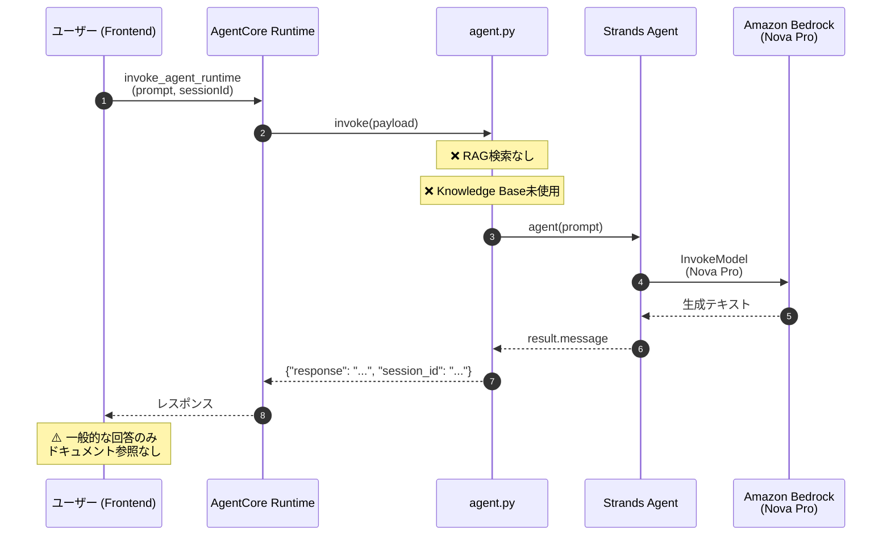
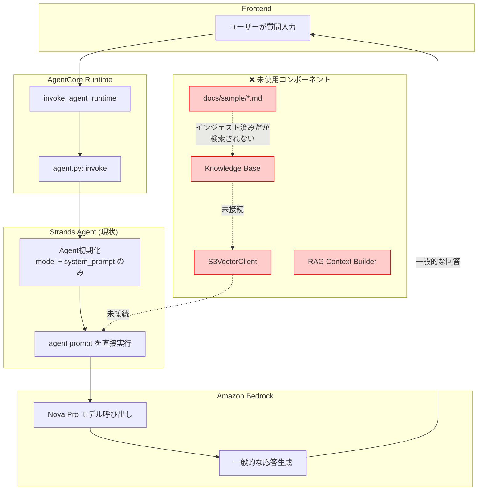
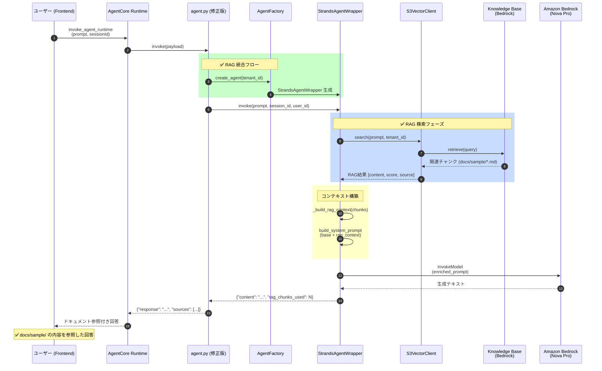
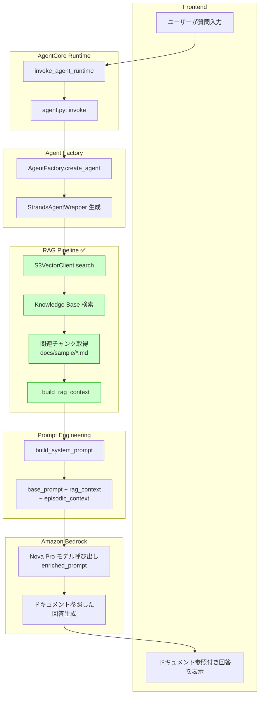

# RAG 実装分析レポート

## 概要

このドキュメントは、現状のAgentCore RAG実装経路と、理想的な実装経路を分析・比較したものです。

---

## 問題サマリー

| 項目 | 現状 | 理想 |
|------|------|------|
| Knowledge Base 検索 | ❌ 未使用 | ✅ S3Vector から検索 |
| RAG コンテキスト注入 | ❌ なし | ✅ プロンプトに埋め込み |
| `docs/sample/` 参照 | ❌ 不可能 | ✅ 可能 |
| 使用中のエントリポイント | `agent.py` | `agent_factory.py` |

---

## 現状のシーケンス図 (AS-IS)



### 現状のコード (`agent.py`)

```python
# ❌ 問題: RAG統合なし
agent = Agent(
    model=MODEL_ID,
    system_prompt=SYSTEM_PROMPT,  # 固定プロンプトのみ
)

@app.entrypoint
def invoke(payload):
    prompt = payload.get("prompt", "")
    result = agent(prompt)  # 直接呼び出し、RAGなし
    return {"response": result.message}
```

---

## 現状のアクティビティ図 (AS-IS)



---

## 理想的なシーケンス図 (TO-BE)



---

## 理想的なアクティビティ図 (TO-BE)



---

## ファイル構成と役割

```
backend/
├── agent.py                          # ❌ 現在のエントリポイント (RAGなし)
│
├── src/
│   ├── presentation/
│   │   ├── entrypoint/
│   │   │   ├── agent_factory.py      # ✅ RAG統合済み (未使用)
│   │   │   └── prompts.py            # ✅ build_system_prompt
│   │   │
│   │   └── tools/
│   │       └── knowledge_tool.py     # ✅ KB検索ツール (未使用)
│   │
│   └── infrastructure/
│       └── external_services/
│           └── s3vector/
│               └── s3vector_client.py # ✅ S3Vector クライアント (未使用)

docs/sample/
├── api-reference.md                   # サンプルドキュメント
├── faq.md                             # サンプルドキュメント
└── product-guide.md                   # サンプルドキュメント
```

---

## 修正方針

### Option 1: `agent.py` を修正して既存インフラを使用

```python
# agent.py (修正案)
from src.presentation.entrypoint.agent_factory import create_agent, AgentConfig
from src.infrastructure.config.di_container import get_container

# DI コンテナ取得
container = get_container()

# RAG対応エージェント作成
agent_wrapper = create_agent(
    container=container,
    config=AgentConfig(model_id=MODEL_ID),
    tenant_id="default",
)

@app.entrypoint
async def invoke(payload: dict[str, Any]) -> dict[str, Any]:
    prompt = payload.get("prompt", "")
    session_id = payload.get("session_id", "default-session")
    user_id = payload.get("user_id", "default-user")
    
    # RAG統合版の呼び出し
    result = await agent_wrapper.invoke(
        prompt=prompt,
        session_id=session_id,
        user_id=user_id,
    )
    
    return {
        "response": result["content"],
        "sources": result.get("rag_chunks_used", 0),
        "session_id": session_id,
    }
```

### Option 2: Strands Agent に直接 RAG Tool を追加

```python
from strands import Agent, tool
from src.presentation.tools.knowledge_tool import create_knowledge_tool

# RAG ツールを作成
search_kb = create_knowledge_tool(
    vector_client=s3vector_client,
    tenant_id="default",
)

# ツール付きエージェント
agent = Agent(
    model=MODEL_ID,
    system_prompt=SYSTEM_PROMPT,
    tools=[tool(search_kb)],  # RAG検索ツールを追加
)
```

---

## 必要なアクション

1. **Knowledge Base の確認**
   - `docs/sample/` がインジェスト済みか確認
   - Knowledge Base ID の取得

2. **環境変数の設定**
   - `KNOWLEDGE_BASE_ID` を AgentCore Runtime に設定

3. **`agent.py` の修正**
   - RAG 統合コードを追加

4. **デプロイ**
   - 修正版を AgentCore Runtime にデプロイ

---

## 関連リソース

- [Bedrock Knowledge Bases](https://docs.aws.amazon.com/bedrock/latest/userguide/knowledge-base.html)
- [AgentCore Runtime](https://docs.aws.amazon.com/bedrock-agentcore/latest/devguide/)
- [Strands Agents](https://strandsagents.com/docs/)

