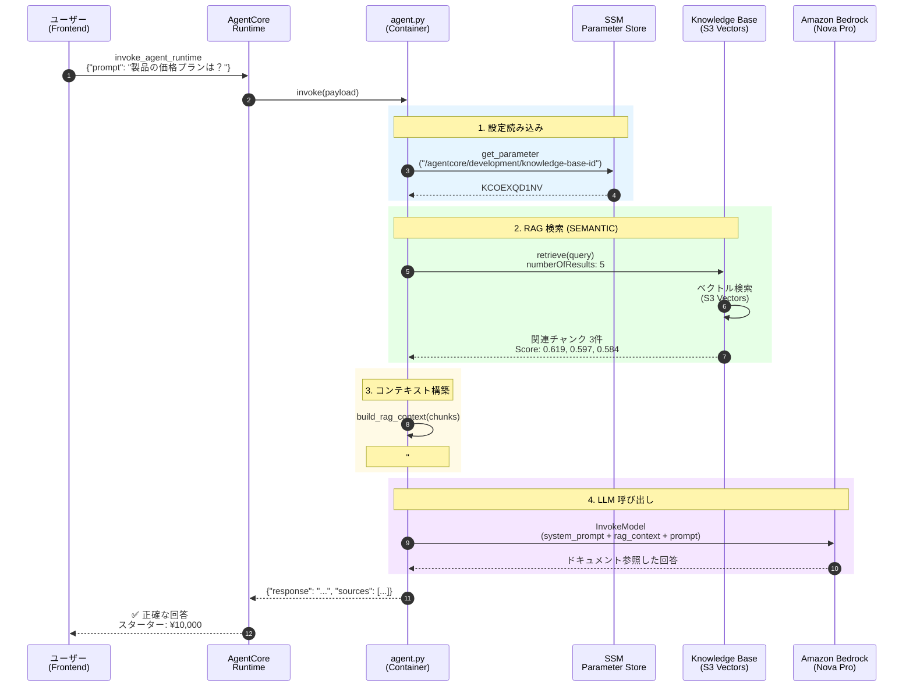
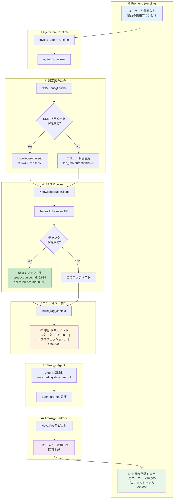
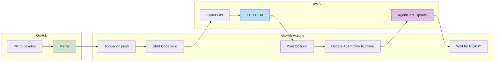

# RAG 実装アーキテクチャ

**最終更新**: 2025年12月10日  
**ステータス**: ✅ 本番稼働中

---

## 概要

AgentCore Runtime と Bedrock Knowledge Base (S3 Vectors) を統合した RAG（Retrieval-Augmented Generation）システムの実装アーキテクチャです。

---

## システム構成

```
┌─────────────────────────────────────────────────────────────────────┐
│                         Frontend (Amplify)                          │
│                   https://develop.d3v4jy5nhse7op.amplifyapp.com     │
└─────────────────────────────────────────────────────────────────────┘
                                    │
                                    ▼
┌─────────────────────────────────────────────────────────────────────┐
│                      AgentCore Runtime                              │
│              agentcoreRuntimeDevelopment-D7hv2Z5zVV                 │
│  ┌───────────────────────────────────────────────────────────────┐  │
│  │                     agent.py (Docker)                         │  │
│  │  ┌─────────────┐  ┌──────────────┐  ┌─────────────────────┐  │  │
│  │  │ SSMConfig   │  │ KBClient     │  │ Strands Agent       │  │  │
│  │  │ Loader      │  │ (Retrieve)   │  │ (Nova Pro)          │  │  │
│  │  └─────────────┘  └──────────────┘  └─────────────────────┘  │  │
│  └───────────────────────────────────────────────────────────────┘  │
└─────────────────────────────────────────────────────────────────────┘
         │                      │                      │
         ▼                      ▼                      ▼
┌─────────────┐    ┌────────────────────┐    ┌─────────────────┐
│ SSM         │    │ Knowledge Base     │    │ Amazon Bedrock  │
│ Parameter   │    │ (S3 Vectors)       │    │ (Nova Pro)      │
│ Store       │    │ KCOEXQD1NV         │    │                 │
└─────────────┘    └────────────────────┘    └─────────────────┘
                            │
                            ▼
                   ┌─────────────────┐
                   │ S3 Documents    │
                   │ docs/sample/    │
                   │ - product-guide │
                   │ - api-reference │
                   │ - faq           │
                   └─────────────────┘
```

---

## シーケンス図

### 正常系フロー



---

## アクティビティ図

### RAG 処理フロー



---

## コンポーネント詳細

### 1. SSMConfigLoader

SSM Parameter Store から設定を読み込むクラス。

```python
class SSMConfigLoader:
    def __init__(self, region: str, environment: str):
        self._client = boto3.client("ssm", region_name=region)
        self._prefix = f"/agentcore/{environment}"
    
    def get(self, key: str, default: str = "") -> str:
        # /agentcore/development/{key} から値を取得
        # キャッシュ機能付き
```

**読み込むパラメータ**:
| パラメータ | 値 | 説明 |
|-----------|-----|------|
| `knowledge-base-id` | `KCOEXQD1NV` | Knowledge Base ID |
| `rag-top-k` | `5` (default) | 取得チャンク数 |
| `rag-score-threshold` | `0.5` (default) | 最低スコア閾値 |

---

### 2. KnowledgeBaseClient

Bedrock Knowledge Base から関連ドキュメントを検索。

```python
class KnowledgeBaseClient:
    def retrieve(self, query: str, top_k: int = 5, score_threshold: float = 0.5):
        response = self._client.retrieve(
            knowledgeBaseId=self._knowledge_base_id,
            retrievalQuery={"text": query},
            retrievalConfiguration={
                "vectorSearchConfiguration": {
                    "numberOfResults": top_k,
                    # SEMANTIC search (default)
                    # Note: HYBRID is NOT supported by S3 Vectors
                }
            }
        )
        # score_threshold 以上のチャンクのみ返す
```

**重要**: S3 Vectors は `HYBRID` 検索をサポートしていないため、デフォルトの `SEMANTIC` 検索を使用。

---

### 3. build_rag_context

取得したチャンクから RAG コンテキストを構築。

```python
def build_rag_context(chunks: list[dict]) -> str:
    context_parts = ["## 参照ドキュメント\n"]
    context_parts.append("以下の社内ドキュメントを参考に回答してください。\n")
    
    for i, chunk in enumerate(chunks[:5], 1):
        content = chunk.get("content", "")[:800]
        source = chunk.get("source", "Unknown")
        score = chunk.get("score", 0.0)
        
        context_parts.append(f"### ドキュメント {i} (関連度: {score:.2f})")
        context_parts.append(f"**ソース**: {source}")
        context_parts.append(f"```\n{content}\n```\n")
    
    return "\n".join(context_parts)
```

---

### 4. System Prompt

RAG コンテキストを含む enriched system prompt。

```python
BASE_SYSTEM_PROMPT = """あなたは優秀なカスタマーサポートアシスタントです。

## 回答のガイドライン
- 参照ドキュメントが提供されている場合は、その内容を優先して回答する
- ドキュメントに記載がない場合は、その旨を伝える
- 簡潔で分かりやすい言葉を使う

## 重要
- 参照ドキュメントの内容に基づいて回答してください
- ドキュメントに記載されていない情報を推測で答えないでください
"""

# RAG コンテキストを追加
enriched_system_prompt = f"{BASE_SYSTEM_PROMPT}\n\n{rag_context}"
```

---

## IAM 権限

### AgentCore Runtime Role

`agentcore-runtime-role-development` に必要な権限:

```json
{
  "Version": "2012-10-17",
  "Statement": [
    {
      "Sid": "BedrockKnowledgeBase",
      "Effect": "Allow",
      "Action": [
        "bedrock:Retrieve",
        "bedrock:RetrieveAndGenerate"
      ],
      "Resource": [
        "arn:aws:bedrock:ap-northeast-1:226484346947:knowledge-base/*"
      ]
    },
    {
      "Sid": "SSMParameterStore",
      "Effect": "Allow",
      "Action": [
        "ssm:GetParameter",
        "ssm:GetParameters"
      ],
      "Resource": [
        "arn:aws:ssm:ap-northeast-1:226484346947:parameter/agentcore/*"
      ]
    },
    {
      "Sid": "BedrockInvokeModel",
      "Effect": "Allow",
      "Action": [
        "bedrock:InvokeModel",
        "bedrock:InvokeModelWithResponseStream"
      ],
      "Resource": "*"
    }
  ]
}
```

---

## デプロイフロー

### CI/CD パイプライン



---

## 監視・トラブルシューティング

### ヘルスチェック

```bash
# AgentCore Runtime ステータス
aws bedrock-agentcore-control get-agent-runtime \
  --agent-runtime-id agentcoreRuntimeDevelopment-D7hv2Z5zVV \
  --region ap-northeast-1 \
  --query 'status'

# Knowledge Base 検索テスト
aws bedrock-agent-runtime retrieve \
  --knowledge-base-id KCOEXQD1NV \
  --retrieval-query '{"text": "製品の価格プランは？"}' \
  --region ap-northeast-1
```

### よくある問題

| 症状 | 原因 | 解決策 |
|------|------|--------|
| RAG が効かない | IAM 権限不足 | `bedrock:Retrieve` 追加 |
| 検索エラー | HYBRID 検索使用 | SEMANTIC に変更 |
| 設定読み込み失敗 | SSM パラメータ未設定 | パラメータ作成 |
| 古い回答が返る | イメージ未更新 | CodeBuild 実行 |

---

## リソース一覧

| リソース | 識別子 | リージョン |
|---------|--------|-----------|
| Knowledge Base | `KCOEXQD1NV` | ap-northeast-1 |
| AgentCore Runtime | `agentcoreRuntimeDevelopment-D7hv2Z5zVV` | ap-northeast-1 |
| AgentCore Endpoint | `agentcoreEndpointDevelopment` | ap-northeast-1 |
| IAM Role | `agentcore-runtime-role-development` | - |
| ECR Repository | `agentic-rag-agent-development` | ap-northeast-1 |
| S3 Documents | `agentcore-documents-226484346947-development` | ap-northeast-1 |
| Data Source ID | `R1BW5OB1WP` | - |

---

## 変更履歴

| 日付 | 変更内容 |
|------|----------|
| 2025-12-10 | IAM 権限追加 (`bedrock:Retrieve`) |
| 2025-12-10 | HYBRID 検索削除 (PR #57) |
| 2025-12-10 | SSM Parameter Store 統合 (PR #55) |
| 2025-12-10 | RAG 統合実装 (PR #52) |
| 2025-12-10 | CI/CD パイプライン実装 (PR #58-60) |
