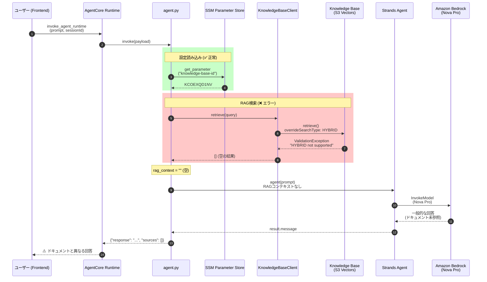
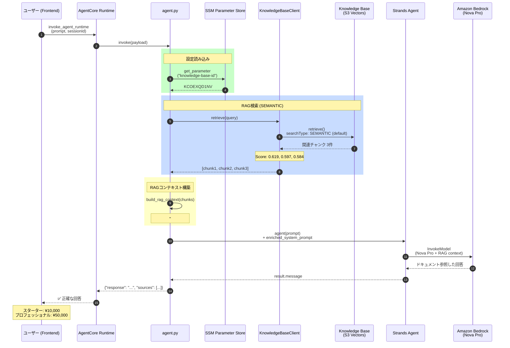

# RAG 実装分析レポート

## 概要

このドキュメントは、AgentCore RAG実装の現状分析と、発見された問題・修正を記録したものです。

---

## 問題サマリー (2025-12-10 更新)

| 項目 | 状態 | 詳細 |
|------|------|------|
| Knowledge Base 検索 | ⚠️ 実装済み (バグあり) | `HYBRID` 検索が S3 Vectors で非サポート |
| RAG コンテキスト注入 | ✅ 実装済み | `build_rag_context()` でプロンプトに埋め込み |
| `docs/sample/` 参照 | ⚠️ 検索エラーで失敗 | S3 にはアップロード済み |
| SSM Parameter Store | ✅ 実装済み | `/agentcore/development/knowledge-base-id` |

### 🔴 根本原因

```python
# agent.py (line 165) - 問題のコード
retrievalConfiguration={
    "vectorSearchConfiguration": {
        "numberOfResults": top_k,
        "overrideSearchType": "HYBRID",  # ❌ S3 Vectors でサポートされていない
    }
}
```

**エラー**: `ValidationException: HYBRID search type is not supported for search operation on index KCOEXQD1NV`

このエラーが `try/except` でキャッチされ、空の結果 `[]` を返すため、RAG が効いていなかった。

---

## 現状のシーケンス図 (バグあり)



---

## 現状のアクティビティ図 (バグあり)

```mermaid
flowchart TD
    subgraph Frontend
        A[ユーザーが質問入力<br/>"製品の価格プランは？"]
    end
    
    subgraph AgentCore Runtime
        B[invoke_agent_runtime]
        C[agent.py: invoke]
    end
    
    subgraph "設定読み込み ✅"
        D[SSMConfigLoader]
        E[knowledge-base-id = KCOEXQD1NV<br/>rag-top-k = 5<br/>rag-score-threshold = 0.5]
    end
    
    subgraph "RAG Pipeline ❌"
        F[KnowledgeBaseClient.retrieve]
        G{overrideSearchType<br/>= HYBRID}
        H[ValidationException!<br/>HYBRID not supported]
        I[return empty list]
    end
    
    subgraph "コンテキスト構築"
        J[build_rag_context]
        K[rag_context = ""<br/>チャンク0件]
    end
    
    subgraph "Strands Agent"
        L[Agent 初期化<br/>system_prompt + 空のRAGコンテキスト]
        M[agent prompt 実行]
    end
    
    subgraph Amazon Bedrock
        N[Nova Pro 呼び出し]
        O[一般的な回答生成<br/>❌ ドキュメント未参照]
    end
    
    A --> B
    B --> C
    C --> D
    D --> E
    E --> F
    F --> G
    G -->|エラー| H
    H --> I
    I --> J
    J --> K
    K --> L
    L --> M
    M --> N
    N --> O
    O -->|ベーシック ¥1,000<br/>スタンダード ¥3,000<br/>プレミアム ¥5,000| A
    
    style G fill:#ffcccc,stroke:#ff0000
    style H fill:#ffcccc,stroke:#ff0000
    style I fill:#ffcccc,stroke:#ff0000
    style K fill:#ffffcc,stroke:#ffaa00
    style O fill:#ffcccc,stroke:#ff0000
```

---

## 修正後のシーケンス図 (TO-BE)



---

## 修正後のアクティビティ図 (TO-BE)

```mermaid
flowchart TD
    subgraph Frontend
        A[ユーザーが質問入力<br/>"製品の価格プランは？"]
        Z[正確な回答を表示<br/>スターター: ¥10,000<br/>プロフェッショナル: ¥50,000]
    end
    
    subgraph AgentCore Runtime
        B[invoke_agent_runtime]
        C[agent.py: invoke]
    end
    
    subgraph "設定読み込み ✅"
        D[SSMConfigLoader]
        E[knowledge-base-id = KCOEXQD1NV]
    end
    
    subgraph "RAG Pipeline ✅"
        F[KnowledgeBaseClient.retrieve]
        G[SEMANTIC検索<br/>overrideSearchType なし]
        H[Knowledge Base 検索成功]
        I[チャンク3件取得<br/>Score: 0.619, 0.597, 0.584]
    end
    
    subgraph "コンテキスト構築 ✅"
        J[build_rag_context]
        K["rag_context =<br/>## 参照ドキュメント<br/>| スターター | ¥10,000 |<br/>| プロフェッショナル | ¥50,000 |"]
    end
    
    subgraph "Strands Agent"
        L[Agent 初期化<br/>system_prompt + RAGコンテキスト]
        M[agent prompt 実行]
    end
    
    subgraph Amazon Bedrock
        N[Nova Pro 呼び出し<br/>enriched_prompt]
        O[ドキュメント参照した<br/>回答生成]
    end
    
    A --> B
    B --> C
    C --> D
    D --> E
    E --> F
    F --> G
    G --> H
    H --> I
    I --> J
    J --> K
    K --> L
    L --> M
    M --> N
    N --> O
    O --> Z
    
    style G fill:#ccffcc,stroke:#00aa00
    style H fill:#ccffcc,stroke:#00aa00
    style I fill:#ccffcc,stroke:#00aa00
    style K fill:#ccffcc,stroke:#00aa00
    style O fill:#ccffcc,stroke:#00aa00
```

---

## ファイル構成と役割 (現在)

```
backend/
├── agent.py                          # ✅ エントリポイント (RAG統合済み)
│   ├── SSMConfigLoader               # SSM Parameter Store から設定取得
│   ├── KnowledgeBaseClient           # Bedrock Knowledge Base 検索
│   ├── build_rag_context()           # RAGコンテキスト構築
│   └── invoke()                      # AgentCore エントリポイント
│
├── Dockerfile                        # 環境変数: AWS_REGION, AGENTCORE_ENV
│
└── requirements.txt                  # boto3, strands-agents, etc.

docs/sample/                          # S3にアップロード済み
├── api-reference.md                  # → s3://agentcore-documents-*/documents/
├── faq.md
└── product-guide.md                  # ← 価格プラン情報
```

---

## 修正内容 (PR #57)

```diff
# backend/agent.py

- response = self._client.retrieve(
-     knowledgeBaseId=self._knowledge_base_id,
-     retrievalQuery={"text": query},
-     retrievalConfiguration={
-         "vectorSearchConfiguration": {
-             "numberOfResults": top_k,
-             "overrideSearchType": "HYBRID",  # ❌ 削除
-         }
-     },
- )

+ response = self._client.retrieve(
+     knowledgeBaseId=self._knowledge_base_id,
+     retrievalQuery={"text": query},
+     retrievalConfiguration={
+         "vectorSearchConfiguration": {
+             "numberOfResults": top_k,
+             # Note: HYBRID search is not supported by S3 Vectors
+             # Use default SEMANTIC search instead
+         }
+     },
+ )
```

---

## デプロイ手順

1. **PR #57 をマージ**
   ```bash
   gh pr merge 57 --squash
   ```

2. **CodeBuild でイメージ再ビルド**
   ```bash
   aws codebuild start-build --project-name agentic-rag-build-development --region ap-northeast-1
   ```

3. **AgentCore Runtime 更新**
   ```bash
   python3 -c "
   import boto3
   client = boto3.client('bedrock-agentcore-control', region_name='ap-northeast-1')
   client.update_agent_runtime(
       agentRuntimeId='agentcoreRuntimeDevelopment-D7hv2Z5zVV',
       agentRuntimeArtifact={'containerConfiguration': {'containerUri': '226484346947.dkr.ecr.ap-northeast-1.amazonaws.com/agentic-rag-agent-development:latest'}},
       roleArn='arn:aws:iam::226484346947:role/agentcore-runtime-role-development',
       networkConfiguration={'networkMode': 'PUBLIC'}
   )"
   ```

4. **動作確認**
   - https://develop.d3v4jy5nhse7op.amplifyapp.com/ でチャット
   - 「製品の価格プランは？」と質問
   - **スターター ¥10,000、プロフェッショナル ¥50,000** が返れば成功

---

## 関連リソース

- [Bedrock Knowledge Bases](https://docs.aws.amazon.com/bedrock/latest/userguide/knowledge-base.html)
- [S3 Vectors (Preview)](https://docs.aws.amazon.com/AmazonS3/latest/userguide/s3-express-one-zone.html)
- [AgentCore Runtime](https://docs.aws.amazon.com/bedrock-agentcore/latest/devguide/)
- [Strands Agents](https://strandsagents.com/docs/)

---

## 変更履歴

| 日付 | 内容 |
|------|------|
| 2025-12-10 | HYBRID検索バグ発見、修正PR #57 作成 |
| 2025-12-10 | SSM Parameter Store 統合 (PR #55) |
| 2025-12-10 | RAG統合実装 (PR #52) |
