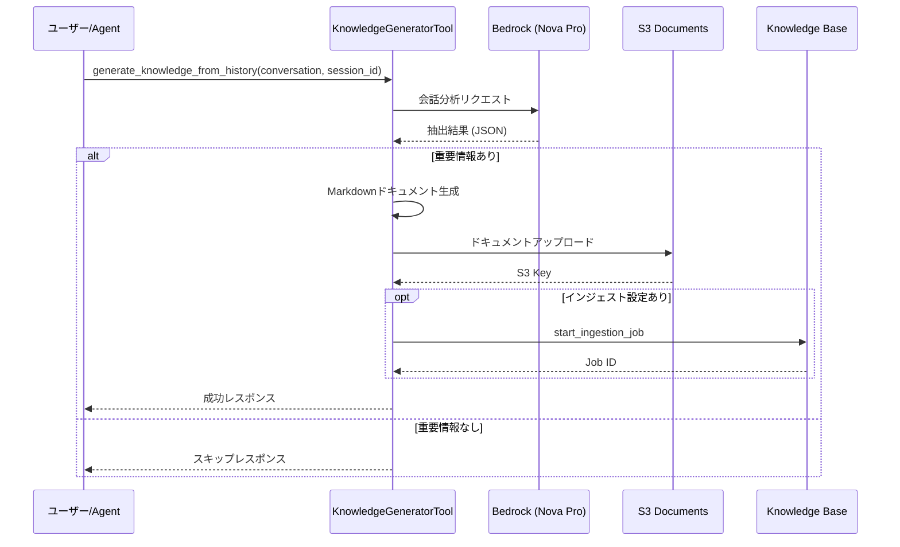

# チャット履歴からナレッジ自動生成

**作成日**: 2025年12月11日  
**ステータス**: ✅ 実装完了

---

## 概要

チャット履歴を分析し、重要な情報を自動抽出してKnowledge Base（RAG）に追加するナレッジドキュメントを生成する機能。

---

## アーキテクチャ

```
┌─────────────────────────────────────────────────────────────────────┐
│                      Knowledge Generation Flow                       │
├─────────────────────────────────────────────────────────────────────┤
│                                                                      │
│  ┌──────────────┐     ┌──────────────┐     ┌──────────────────────┐ │
│  │ Chat History │────▶│ LLM Analysis │────▶│ Document Generation  │ │
│  │              │     │ (Nova Pro)   │     │ (Markdown)           │ │
│  └──────────────┘     └──────────────┘     └──────────────────────┘ │
│                                                       │              │
│                                                       ▼              │
│                              ┌────────────────────────────────────┐  │
│                              │ S3 Documents Bucket                │  │
│                              │ documents/generated/{category}/    │  │
│                              └────────────────────────────────────┘  │
│                                                       │              │
│                                                       ▼              │
│                              ┌────────────────────────────────────┐  │
│                              │ Knowledge Base Ingestion           │  │
│                              │ (Automatic Trigger)                │  │
│                              └────────────────────────────────────┘  │
│                                                                      │
└─────────────────────────────────────────────────────────────────────┘
```

---

## 実装方式

### 技術選定

| 選択肢 | 採用 | 理由 |
|--------|------|------|
| AgentCore Memory | ❌ | ファイル生成機能なし |
| LangGraph | ❌ | 複雑なワークフローは不要 |
| **Strands Agent + Tool** | ✅ | シンプルで十分な機能 |

### 処理フロー



---

## 使用方法

### 1. Strands Agent の Tool として使用

```python
from strands import Agent, tool
from src.presentation.tools import create_knowledge_generator_tool

# ツール作成
generator_tool = create_knowledge_generator_tool(
    s3_bucket="agentcore-documents-xxx-development",
    s3_prefix="documents/generated/",
    knowledge_base_id="KCOEXQD1NV",
    data_source_id="R1BW5OB1WP",
    model_id="apac.amazon.nova-pro-v1:0",
)

# Agent に登録
agent = Agent(
    model="apac.amazon.nova-pro-v1:0",
    system_prompt="...",
    tools=[tool(generator_tool)],
)

# Agent が自動的にツールを呼び出す
result = agent("この会話を記録して、ナレッジベースに保存して")
```

### 2. 直接呼び出し（非Agent）

```python
from src.presentation.tools import generate_knowledge_document

conversation = [
    {"role": "user", "content": "料金プランについて教えて"},
    {"role": "assistant", "content": "スターターは¥10,000/月です..."},
    {"role": "user", "content": "プロフェッショナルとの違いは？"},
    {"role": "assistant", "content": "APIアクセスとストレージ容量が異なります..."},
]

result = await generate_knowledge_document(
    conversation=conversation,
    session_id="sess-123",
    s3_bucket="agentcore-documents-xxx-development",
    knowledge_base_id="KCOEXQD1NV",
    data_source_id="R1BW5OB1WP",
)

print(result)
# {
#     "success": True,
#     "document_key": "documents/generated/faq/20251211_料金プラン比較.md",
#     "title": "料金プラン比較FAQ",
#     "category": "faq",
#     "tags": ["料金", "プラン"],
#     "ingestion_triggered": True
# }
```

### 3. agent.py への統合例

```python
# agent.py に追加

from strands import tool
from src.presentation.tools import create_knowledge_generator_tool

# Knowledge Generator Tool
knowledge_generator = create_knowledge_generator_tool(
    s3_bucket=ssm_config.get("documents-bucket", ""),
    knowledge_base_id=KNOWLEDGE_BASE_ID,
    data_source_id=ssm_config.get("data-source-id", ""),
)

# Agent 作成時に追加
agent = Agent(
    model=MODEL_ID,
    system_prompt=enriched_system_prompt,
    tools=[tool(knowledge_generator)],  # ツール追加
)
```

---

## 生成ドキュメント形式

### ファイル構造

```
documents/generated/
├── faq/
│   ├── 20251211_120000_料金プラン比較.md
│   └── 20251211_143000_APIエラー対処法.md
├── troubleshooting/
│   └── 20251211_150000_接続エラー解決.md
├── decision/
│   └── 20251211_160000_アーキテクチャ決定.md
└── learning/
    └── 20251211_170000_パフォーマンス改善.md
```

### Markdownテンプレート

```markdown
# {タイトル}

**カテゴリ**: {faq|troubleshooting|decision|learning}  
**タグ**: {タグ1, タグ2}  
**作成日**: {ISO 8601}  
**ソース**: チャットセッション {session_id}

---

## 概要

{1-2文の要約}

## {セクション1}

{内容}

## {セクション2}

{内容}

---

*このドキュメントは会話履歴から自動生成されました。*
```

---

## 抽出カテゴリ

| カテゴリ | 説明 | 例 |
|---------|------|-----|
| `faq` | よくある質問と回答 | 料金、機能、使い方 |
| `troubleshooting` | 問題と解決策 | エラー対処、設定修正 |
| `decision` | 決定事項・合意内容 | 仕様決定、方針決定 |
| `learning` | 学習・ベストプラクティス | 最適化、改善方法 |

---

## 設定パラメータ

### SSM Parameter Store

| パラメータ | 説明 |
|-----------|------|
| `/agentcore/{env}/documents-bucket` | S3バケット名 |
| `/agentcore/{env}/knowledge-base-id` | KB ID |
| `/agentcore/{env}/data-source-id` | Data Source ID |

### 環境変数

| 変数 | デフォルト | 説明 |
|------|----------|------|
| `KNOWLEDGE_GENERATOR_MODEL` | `apac.amazon.nova-pro-v1:0` | 分析用モデル |
| `KNOWLEDGE_S3_PREFIX` | `documents/generated/` | S3プレフィックス |

---

## IAM権限

```json
{
  "Version": "2012-10-17",
  "Statement": [
    {
      "Sid": "S3DocumentUpload",
      "Effect": "Allow",
      "Action": [
        "s3:PutObject",
        "s3:PutObjectAcl"
      ],
      "Resource": "arn:aws:s3:::agentcore-documents-*/documents/generated/*"
    },
    {
      "Sid": "BedrockInvokeModel",
      "Effect": "Allow",
      "Action": "bedrock:InvokeModel",
      "Resource": "*"
    },
    {
      "Sid": "KnowledgeBaseIngestion",
      "Effect": "Allow",
      "Action": "bedrock:StartIngestionJob",
      "Resource": "arn:aws:bedrock:*:*:knowledge-base/*"
    }
  ]
}
```

---

## 制限事項・注意点

1. **個人情報**: 会話に含まれる個人情報は自動的にフィルタリングされません。LLMの分析プロンプトで除外を指示していますが、完全ではありません。

2. **インジェスト遅延**: S3アップロード後、Knowledge Baseへの反映には数分かかります。

3. **重複防止**: 同じ会話から複数回ドキュメントを生成すると重複が発生します。セッションID管理が必要です。

4. **コスト**: LLM分析のためBedrock呼び出しコストが発生します。

---

## 今後の拡張案

- [ ] 重複検出・マージ機能
- [ ] 人間レビューワークフロー
- [ ] ドキュメント品質スコアリング
- [ ] 自動タグ付け精度向上
- [ ] 複数言語対応


