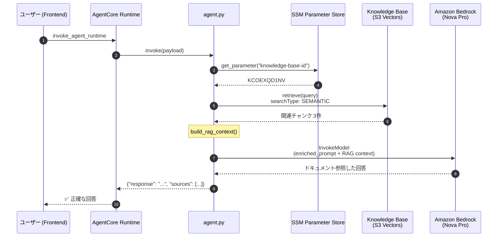

# RAG 実装トラブルシューティングレポート

**日付**: 2025年12月10日  
**作成者**: AI Assistant  
**ステータス**: ✅ 解決済み

---

## エグゼクティブサマリー

AgentCore Runtime の RAG（Retrieval-Augmented Generation）機能が正しく動作せず、ドキュメント（`docs/sample/`）の内容を参照した回答ができていなかった問題を調査・解決しました。

**結果**: RAG 機能が正常に動作し、Knowledge Base から正しいドキュメント情報を取得して回答に反映されるようになりました。

---

## 問題の症状

### ユーザーからの報告

チャットで「製品の価格プランは？」と質問した際：

**期待される回答**（`docs/sample/product-guide.md` より）:
- スターター: ¥10,000
- プロフェッショナル: ¥50,000
- エンタープライズ: 要相談

**実際の回答**（AI が生成した誤った情報）:
- ベーシック: ¥1,000
- スタンダード: ¥3,000
- プレミアム: ¥5,000

→ **ドキュメントを参照せず、LLM が一般的な回答を生成していた**

---

## 調査プロセス

### Phase 1: Knowledge Base 検索の確認

```bash
# Knowledge Base 検索テスト
python3 -c "
import boto3
client = boto3.client('bedrock-agent-runtime', region_name='ap-northeast-1')
response = client.retrieve(
    knowledgeBaseId='KCOEXQD1NV',
    retrievalQuery={'text': '製品の価格プランは？'},
    retrievalConfiguration={'vectorSearchConfiguration': {'numberOfResults': 5}}
)
print(response)
"
```

**結果**: 正しいドキュメントが取得された
```
[1] Score: 0.619 - product-guide.md
    > | スターター | ¥10,000 | 基本チャット、1GB ストレージ |
    > | プロフェッショナル | ¥50,000 | 全機能、10GB ストレージ、API |
```

→ **Knowledge Base 自体は正常に動作**

---

### Phase 2: agent.py の検索コード確認

`backend/agent.py` の Knowledge Base 検索部分を確認：

```python
# 問題のコード (line 165)
retrievalConfiguration={
    "vectorSearchConfiguration": {
        "numberOfResults": top_k,
        "overrideSearchType": "HYBRID",  # ❌ 問題
    }
}
```

**問題発見**: `overrideSearchType: "HYBRID"` が S3 Vectors でサポートされていなかった

```
ValidationException: HYBRID search type is not supported for search operation 
on index KCOEXQD1NV
```

→ **例外がキャッチされ、空の結果 `[]` が返されていた**

---

### Phase 3: HYBRID 検索の削除（PR #57）

```diff
- "overrideSearchType": "HYBRID",
+ # Note: HYBRID search is not supported by S3 Vectors
+ # Use default SEMANTIC search instead
```

**結果**: 検索は成功するようになったが、まだ RAG が効いていない

---

### Phase 4: AgentCore Runtime 直接テスト

```python
response = client.invoke_agent_runtime(
    agentRuntimeArn='...',
    payload=json.dumps({"prompt": "製品の価格プランは？"}).encode()
)
# Response に sources がない → RAG が使われていない
```

---

### Phase 5: IAM 権限の調査

AgentCore Runtime の IAM Role を確認：

```bash
aws iam simulate-principal-policy \
  --policy-source-arn arn:aws:iam::226484346947:role/agentcore-runtime-role-development \
  --action-names bedrock:Retrieve \
  --resource-arns '*'
```

**結果**: `implicitDeny` ❌

→ **AgentCore Runtime に Knowledge Base へのアクセス権限がなかった**

---

## 根本原因

### 原因 1: HYBRID 検索タイプの非サポート

| 検索タイプ | S3 Vectors | OpenSearch Serverless |
|-----------|-----------|----------------------|
| SEMANTIC  | ✅ サポート | ✅ サポート |
| HYBRID    | ❌ 非サポート | ✅ サポート |

`agent.py` が `HYBRID` 検索を指定していたため、`ValidationException` が発生し、エラーハンドリングで空の結果が返されていた。

### 原因 2: IAM 権限不足

AgentCore Runtime の IAM Role (`agentcore-runtime-role-development`) に以下の権限が不足：

```json
{
  "Action": [
    "bedrock:Retrieve",
    "bedrock:RetrieveAndGenerate"
  ],
  "Resource": "arn:aws:bedrock:ap-northeast-1:226484346947:knowledge-base/*"
}
```

---

## 解決策

### 修正 1: HYBRID 検索の削除

**PR #57**: `fix(backend): remove HYBRID search type - not supported by S3 Vectors`

```python
# Before
retrievalConfiguration={
    "vectorSearchConfiguration": {
        "numberOfResults": top_k,
        "overrideSearchType": "HYBRID",
    }
}

# After
retrievalConfiguration={
    "vectorSearchConfiguration": {
        "numberOfResults": top_k,
        # Note: HYBRID search is not supported by S3 Vectors
        # Use default SEMANTIC search instead
    }
}
```

### 修正 2: IAM 権限の追加

```bash
aws iam put-role-policy \
  --role-name agentcore-runtime-role-development \
  --policy-name BedrockKnowledgeBaseAccess \
  --policy-document '{
    "Version": "2012-10-17",
    "Statement": [{
      "Sid": "BedrockKnowledgeBase",
      "Effect": "Allow",
      "Action": ["bedrock:Retrieve", "bedrock:RetrieveAndGenerate"],
      "Resource": ["arn:aws:bedrock:ap-northeast-1:226484346947:knowledge-base/*"]
    }]
  }'
```

### 修正 3: AgentCore Runtime の再起動

IAM 権限変更を反映するため、AgentCore Runtime を更新：

```python
client.update_agent_runtime(
    agentRuntimeId='agentcoreRuntimeDevelopment-D7hv2Z5zVV',
    agentRuntimeArtifact={...},
    roleArn='arn:aws:iam::226484346947:role/agentcore-runtime-role-development',
    networkConfiguration={'networkMode': 'PUBLIC'}
)
```

---

## 追加実装: GitHub Actions 自動デプロイ

### PR #58-60: CI/CD パイプライン

develop ブランチへのマージ時に自動的に AgentCore をデプロイ：

```yaml
# .github/workflows/deploy-agentcore.yml
on:
  push:
    branches: [develop]
    paths: ['backend/**']

jobs:
  deploy:
    steps:
      - name: Start CodeBuild
      - name: Wait for CodeBuild
      - name: Update AgentCore Runtime
      - name: Wait for AgentCore Runtime
```

**必要な GitHub Secrets**:
- `AWS_ACCESS_KEY_ID`
- `AWS_SECRET_ACCESS_KEY`

---

## 検証結果

### 修正後のテスト

```python
response = client.invoke_agent_runtime(...)
data = json.loads(response['response'].read())

# ✅ RAG Sources が含まれる
print(data['sources'])
# [
#   {"source": "product-guide.md", "score": 0.619},
#   {"source": "api-reference.md", "score": 0.597}
# ]

# ✅ 正しい価格情報
# | スターター | ¥10,000 |
# | プロフェッショナル | ¥50,000 |
# | エンタープライズ | 要相談 |
```

---

## アーキテクチャ図

### 修正後のシーケンス



---

## 学んだ教訓

### 1. S3 Vectors の制限事項

S3 Vectors (Preview) は軽量でコスト効率が良いが、HYBRID 検索をサポートしていない。HYBRID 検索が必要な場合は OpenSearch Serverless を検討する。

### 2. IAM 権限のトラブルシューティング

新しい AWS サービス（bedrock-agentcore など）では、必要な IAM 権限が明確でない場合がある。`aws iam simulate-principal-policy` でテストすることが重要。

### 3. エラーハンドリングの重要性

`try/except` でエラーをキャッチする際、静かに失敗（空の結果を返す）すると問題の発見が遅れる。ログ出力を充実させることが重要。

### 4. CI/CD パイプラインの必要性

手動デプロイは時間がかかりミスが発生しやすい。GitHub Actions による自動デプロイを実装することで、マージ後すぐに変更が反映されるようになった。

---

## 関連リソース

| リソース | 値 |
|---------|-----|
| Knowledge Base ID | `KCOEXQD1NV` |
| AgentCore Runtime ID | `agentcoreRuntimeDevelopment-D7hv2Z5zVV` |
| AgentCore Endpoint | `agentcoreEndpointDevelopment` |
| IAM Role | `agentcore-runtime-role-development` |
| ECR Repository | `agentic-rag-agent-development` |
| S3 Documents Bucket | `agentcore-documents-226484346947-development` |

---

## 関連 PR

| PR | タイトル | 内容 |
|----|---------|------|
| #52 | feat(backend): integrate Knowledge Base RAG in AgentCore Runtime | RAG 統合の初期実装 |
| #55 | refactor: SSM Parameter Storeから設定を取得するように変更 | SSM からの設定読み込み |
| #57 | fix(backend): HYBRID検索を削除 | S3 Vectors 非サポートの修正 |
| #58 | ci: develop マージ時に AgentCore 自動デプロイ | GitHub Actions CI/CD |
| #59-60 | fix(ci): GitHub Actions 修正 | boto3 バージョン、IAM 権限修正 |

---

## 今後の改善案

1. **ログ出力の強化**: AgentCore Runtime のログを CloudWatch に出力し、デバッグを容易に
2. **Infrastructure as Code**: IAM 権限を CDK/Terraform で管理し、権限漏れを防止
3. **監視・アラート**: RAG 検索の成功率を監視し、失敗時にアラート
4. **OpenSearch への移行検討**: HYBRID 検索が必要な場合に備えて検討

---

## 変更履歴

| 日時 | 内容 |
|------|------|
| 2025-12-10 11:00 | 問題報告: RAG が効いていない |
| 2025-12-10 11:30 | 調査開始: HYBRID 検索エラー発見 |
| 2025-12-10 12:00 | PR #57 作成: HYBRID 検索削除 |
| 2025-12-10 14:00 | GitHub Actions CI/CD 実装 |
| 2025-12-10 15:30 | IAM 権限不足を発見・修正 |
| 2025-12-10 15:35 | ✅ RAG 動作確認 |


